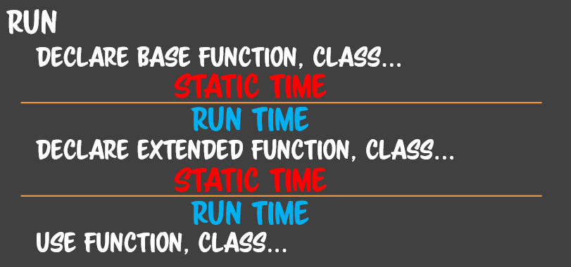

## To Be Actual Programmer

### 프로그래밍이 어려운 이유1

실제적으로 개발할 수 있는 개발자는 복잡성을 다룰 수 있는 개발자이다. 우리가 원하는 것은 복잡성을 정복하는 여러가지 수단을 강구하는 것이다. 배울려는 목적이 복잡성을 관리할 수 잇는가 아닌가에 있다.

### 프로그래밍이 어려운 이유2

단 하나의 프로그래밍 법칙은 '모든 프로그래밍은 변한다.' 모든 프로그램은 변한다. 프로그램을 만들었으면 향후 변화에 대해서 받아들일수 잇도록 프로그램을 짰는지가 중요하다.

**실제 프로그래머가 되는 것은 복잡성을 정복할수 있다는 것이다. 버전 1.2로 만들어서 수정해서 프로그램을 만들수 있냐는 것이다.**


## Program & Timing

**프로그램은 어디서부터 프로그램인가?**
컴퓨터 메모리에 적재된 이후에 설행되기 직전 상태 부터 프로그램이라고 한다. 즉 실행가능한 코드가 메모리에 적재된 상태가 프로그램이고 그것을 만드는 것이 프로그래밍, 만드는 사람을 프로그래머라고 한다. 

```
┌──────────────────┬──────────────
│ LANGUAGE CODE    │ LINT TIME
├──────────────────┼──────────────
│ MACHINE LANGUAGE │ COMPILE TIME
├──────────────────┼──────────────
│ FILE             │
├──────────────────┼──────────────
│ LOAD             │ 
├──────────────────┼──────────────
│ RUN              │ RUN TIME
├──────────────────┼──────────────
│ TERMINATE        │
└──────────────────┴──────────────
```


먼저 Language code를 짜게 된다.
도움 : Linting 아직 컴파일 전이지만, 네가 제대로 코딩하는지를 힌트를 준다. 니가 짠 텍스트만 봐도 틀린거 같다. 이것을 Lint time 이라고 한다. 코드를 짜고 잇을때 lint time이 시작된다.

그다음 기계언어로 컴파일을 하게 된다. 기계가 이해할수 있는 언어로 만들어주기 때문에. 컴파일을 할때 코드가 틀리면 에러가 발생하는데 이런 것들을 compile time 이라고 한다.

컴파일 타임, 린트 타임을 통과하면 파일을 만들고, 적재를 하고 실행을 하게 된다.
컴파일러를 속일수 있다. JS도 JS엔진을 속일수 있다.

컴파일 이후 파일로 만들게 된다. 프로그램이 될수 있는 파일인 것이다.
실행을 하게 되면 먼저 적재가 일어나게 된다.

하지만 실행을 하게 되면 말이 안된다는 것을 알수 있다. 
숫자를 0으로 나눈다던지, null 객체의 메소드 호출이라던지
이런 시점을 런타임 이라고 부른다. 실행시점이라서 그러하다.

실행이 끝나면 종료가 되는 것이다.

==
이러한 여러 단계를 통해서 프로그램을 수정하고 실행되는 건데, 여기에 나와있지 않지만, 프로그래밍 생명주기에서는 안나와있지만, 런타임 에러 조차 안걸리는 경우가 있다. 이러한 것을 context 에러라고 한다. 

린트, 캄파일, 런타임에서 조차 에러가 나면 다행이지만 ,context 에러가 나오면 굉장히 상황이 악화된 것이다. 기보적인 전략은 앞의 시점에서 에러를 잡고 좋은 코드를 짜는 것이며, 이것을 컴파일 랭귀지의 전략이다.

그에 반해서 현대패러다임은 복잡한 컴파일 과정 없이 간편하게 실행시킬 수 있는 런타임 스크립트 라는 방식을 도입했다. 그래서 런타임언어에서는 어떤일이 일어나느냐


```
┌──────────────────┬──────────────
│ LANGUAGE CODE    │ LINT TIME
├──────────────────┼──────────────
│ FILE             │
├──────────────────┼──────────────
│ LOAD             │ 
├──────────────────┼──────────────
│ MACHINE LANGUAGE │ 
├──────────────────┼──────────────
│ RUN              │ RUN TIME
├──────────────────┼──────────────
│ TERMINATE        │
└──────────────────┴──────────────
```


먼저 JS 를 작성한다. 린트에 도움을 받는다.
그다음  저장한다. 그다음 로드한다. 브라우저에서 URL 뜨게 되면 적재가 도니다.
그다음에 로드를 하고 나서 이것을 기계어로 알아서 변경한다. 매번.. 이것을 오토컴파일이라고 볼수 있다. 현대의 자바스크립트는 오토 컴파일을 하는데, 컴파일 언어와는 큰 차이가 있다.

컴파일 방식에서는 컴파일해서 하나의 파일로 만들기 위해서 코드를 전부 빠짐 없이 해석해서 컴파일 한다. 하지만 오토 컴파일 방식에서는 내가 지금 바라보는 파일에 대해서만 검사하고 컴파일 하는 것이다. 하지만 거기에 더 나아가서 하나의 파일 내에서도 부분적으로만 머신 코드로만 바꾸고 그외에는 해석하지 않는다. 이렇게 부분적인 컴파일 전략을 사용한다.

따라서 전체검사의 혜택이 없어서 개발자에게 더 많은 책임을 부여한다. 그리고 런타임에 실행이 되고 종료가 된다. 이것이 일반적인 스크립트 언어의 작동 방식이다.
여기에 JS에서는 린트타임과 런타임 에서의 에러만 잡는건가? 실행시점에서는 실행 시점에 에러가 발생하기 전까지는 에러를 잡을수 없다. 그래서 에러를 잡기가 상당히 어렵다. 대부분의 런타임 에러는 잡을수가 없다. 런타임에러는 기본적으로 잡을수 없다. 

스크립트 언어에서는 그래서 이것을 보완할 수단이 필요하다. 컴파일 스타일로 짜는 것은 타입 스크립트와 같은 것들이 있다. 또는 스크립트 개발론들이 있다.

거기서는 JS에서는 런타임 밖에 없지만, 런타임을 자세히 보면 기저가 되는 함수, 클래스를 만들고 정의하고 다시 그것을 이용하는 응용 클래스, 응용 함수를 만들게 된다. 그당므 다시 그것을 사용하는 코드가 나온다. 그것들을 각각 추상 레이어라고 보았을때, 그 안에서 다시 static time, runtime이 각각 상대적으로 나뉘어진다. 그래서 레이어 별로 런타임을 세세하게 나누는 전략을 하게 되면 실행 중에 에러가 어디에서 나는지를 나눌수가 있게 된다. 이렇게 되면 에러가 일어난 부분에서 그 부분에서의 코드만 수정하면 된다. 

이렇게 물리적으로는 나뉘어 있지 않는데, 의미론 적으로 나뉘어서 관리를 하게 된다. 스크립트 개발론에서는... // 찾기 이ㅜ해 나누는것이다. // 복잡성을 정복하기 위한 기본적인 전략은 노란선 즉 격리를 하는 것이다. 



프로그램이 되기 위한 첫조건이 복잡성을 정복하는 것인데, 이것을 하기 위한 방법은 **격리**이다. 클래스, 라이브러리, DP , 프레임워크를 쓰던 주요한 관심사는 어떤 에러가 났을때 어디 소속이고 걔의 책임인지를 알수 있기 위한 격리 구간을 만드는데 있다. 개발자로서 성공하기 위해서는 격리하는 방법을 알아야 한다. 

코드를 짤때에는 격리를 인식할 거야. 예를 들어 내가 만든 프로그램에서 15가지 요소로 되어 있는데 13번 요소는 내가 짠 코드 13번 함수에서만 에러가 나. 이러한 감각을 익혀나가면 좋은 개발자가 될 수 있다.

처음 입문하는 사람들이 지루하고 어렵기 때문에, 흥미를 유발하는 방법론을 사용한다. 쥐뿔도 안 배운 상태에서 토이프로젝트를 만들게 한다. 대부분의 입문자들이 무의미한 토이프로젝트를 만들고 아무것도 모르는 상태로 끝나게 된다. 세계가 깊어지지 않게 된다.

깊어지기 위해서는 본인이 코드 하나를 짜더라도 어떤 의미와 어떤 역할, 어디까지 격리할수 있는지에 대한 인식하는 훈련이 필요하다. 이것은 추상적이기 때문에, 배우기 쉽지 않지만, 배우자~

이것이 프로그래밍에 대한 개념을 배운 것이다.  

이제부터는 CS에 입문했으니 책에 나오는 언어중에 모르는것이 없도록 하고, 당연히 ~하다고 생각하는 것을 의심하고 없도록 해보자.


## LEXICAL GRAMMAR

CONTROL CHARACTER 제어문자 (한국어, 영어는 안쓴다.)

WHITE SPACE 공백문자 (공백은 57개 정도 된다.그래서 JS에0서는 그것을 정의해두었다.)

LINE TERMINATORS 개행문자 (줄을 끊어주며 유니코드에는 6가지 이상의 개행문자가 존재한다.)

COMMENTS 주석 (주석을 하면 그 라인 또는 블록이 주석처리 되며, 엔진이 해당 부분을 무시)

KEYWORD 예약어 (미리 약속되어 있어서 엔진이 이 단어를 만나면 특정한 기능을 수행하게 약속)

LITERALS 리터럴 (언어에서 정의한 더이상 쪼갤수 없는 값의 표현이다. 37보다 더 쪼개서 표현할 방법이 없다. 최소한의 표현이 37이다. 이것을 리터럴이라고 한다. 늘릴 방법은 많다. )

입문자레벨의 자료에서는 자바스크립트를 사실과 다르게 가르키는 건 대부분이다. **js의 구성요소중에 가장 기저가 되는 것**은 LEXICAL GRAMMAR 이다. LEXICAL은 어휘적인 이라는 뜻이다. 즉 어휘적인 문법이다. JS를 짜려면 JS내에 존재하는 문자들에 대해서 알아야 하는 것이다.


## LANGUAGE ELEMENT
자바스크립트 언어는 크게 보면 3가지 요소로 되어 잇다. 

 STATEMENT 문 : 공문, 식문, 제어문, 선언문, 단문, 중문

식별자와 식은 값에 대한 이야기였다. 값이 아닌 모든 것들이 문이다. `;` 의 정체는 무엇인가? 문의 정체는? 자바스크립트 엔진이 어떻게 해석할 지 알려주는 힌트이다. 단지 힌트이기 때문에 실행된 이후에 메모리에서 없어진다. if문, return문을, throw문을 변수에 할당할 수 없다. 이 녀석은 단지 힌트일 뿐이기 때문이다. 따라서 엔진에 실행에 관여할수 있을 뿐이지 메모리로 남지않고, 연산이 될 뿐이다. 명령일 뿐이지 메모리에 흔적이 남지 않고, 값이 될수 없다. 그럼 어디까지가 문이고 식일까? 그것은 언어 설계자의 선택에 따른다. 

ABC 랭귀지. 알골이라는 언어가 있다. 알골이라는 언어를 (최초의 고급언어) 보고 그것을 개조해서 B언어를 만들었다. 여기에는 변수에 타입정보가 없어 C언어를 만들었다. 따라서 C언어의 문법적인 요소는 전부 알골에서부터 비롯되었다. 한국의 거의 모든 언어에 대한 교육은 ABC을 기반으로 한 교육이다. 하지만 ABC언어가 상식이라고 생각하면 안된다. 최근 나와있는 언어들은 전부 자기마음대로 식과 문을 정한다. 

문을 값으로 환원되지 않는, 자바스크립트 엔진에 던져 주는 실행 방법이나 명령이다. 이 문에는 공식적으로 4가지 문이 있다. 

공문 : 아무것도 없는 문을 말한다. `; ; ;` 이런 것들. 스크립트를 짤때 실수를 많이해서 그러하다. 엄격한 문의 구분을 못하니까 그것을 보완하기 위해서 만든 것이다. 

식문 : 하나의 식은 하나의 문이 될 수 잇다. `3+5`는 연산식이지만 `3+5;` 이러면 문이 되는데 아무 문제가 없다. 하나의 식은 하나의 문이 될 수 있기 때문이다. 

제어문 : 28개 정도 있다. 제어문이 아닌 문중에는 선언문이 있다.

선언문 : 식별자를 선언하기 위한 문이다. 


이 외에도 단문, 중문이라는 분류 체계가 있다. 

단문 : 문장 하나를 말하는 것이다.

중문 : 문장 여러개를 묶어서 하나의 문장처럼 보는게 중문이다.

자바스크립트에서는 중괄호를 열고 닫으면 그 안의 문장 전체를 묶어서 하나의 문장으로 봐 주는 기능이 잇다. 그래서 어떠한 문에 단문이 올자리면 예외없이 중문이 올수 있다. 


 EXPRESSION 식 : 값식, 연산식, 호출식

식은 최종적으로 하나의 값으로 수용되는 것을 말한다. 즉 식은 값의 확장된 표현이다. 그래서 식은 단일한 값으로 수용된다. 하나의 값이 될수 잇는 것이 식이다. 

값식 : 3, 7, true (value expression)  하나의 값은 식이 된다.  
연산식 : 연산자를 이용함. `1+3`은 산술 연산자를 사용한 연산식이라고 한다.  연산자가 들어간 식  
호출식 : 함수a가 있어 a() 라고 하면 a의 리턴값일 것이다. 함수로 호출하는 것도 호출식의 일부.

서로가 서로를 포함할 수 있는 관계이다. 식의 조합은 하나의 값으로 떨어진다. 언어에서 큰 축을 구성하고 있는 것이 식이며 식은 값이다. 

연산식에는 연산자에 종류에 따라서 나누는 구분법이 있다. 산술연산자, 논리 연산자등등... 연산자가 많은 편이다. 연산자에 목적에 따라 나누는 방법, 연산자가 받아야 되는 항의 수로 나누는 방법이 있다. 단항 / 이항 / 삼항 연산자/다항 연산자 (대표적인거 `,` ) 코드를 짜다가 연산자는 오퍼레이터, 오퍼레이션 이라고 부르기도 한다. 단항은 특별하게 unray 라고 부르고, bi, triple, multiple operator 라고 부르기도 한다. 

 IDENTIFIER 식별자 : 기본형, 참조형, 변수, 상수

값은  저장하지 않으면 즉시 메모리에서 사라진다. 프로그램은 로드 과정을 통해서 적재되어 실행되는데, 프로그램이 실행되는 과정에서는 프로그램을 계속 소비해 없애 버린다. 그냥 값은 소비되어 없어져 버려서 재활용할수 없어 무의미한 값의 표현이 된다. 

순수한 값을 나타내는 식은 볼수는 있고 소비는 되지만 이용하기가 어렵다. 그러면, 이 값들을 어딘가에 저장했다가 꺼냈다가 해야 하는데 그것이 바로 변수이다. 

변수란? 메모리 주소의 별명이다. 첫번째 속성 : 메모리 주소의 별명이다. 두번째 속성 : 변수는 해당 값에 대한 타입정보를 가지고 있다. 즉 데이터 타입에 대한 정보를 가지고 있다.  즉 변수는 데이터 타입과 메모리 주소를 알고 있는 것이다. 이렇게 이 두가지 의미를 담는 특정한 이름을 지정하는 행위를 **식별자**라고 부른다. 식별자는 안에 담는 값의 형태가 2가지 형태가 올 수 잇다. 첫번째는 3과 같은 값이 들어 올수 잇다. 어떨때는 참조가 들어온다. 다른 메모리 주소를 가르키는 것이다. 

즉 변수안에는 참조 또는 값이 들어가는 것이다. 참조는 다른 메모리의  주소값이다. 그게 아니면 전부 값이다.  그렇다면 값을 쓰는 경우에는 모든 값은 복사할 수 있다. 

어떤 녀석은 복사가 되지 않고 참조가 되기도 한다.  근데 사실 참조 된다는 것도 해당 메모리 주소가 복사된 셈이라서 그냥 복사라고 할수 있을 거 같다. 

세상엔 좋은 개발자가 희귀해서 복잡성을 정복했다면 사회적 강자가 될 수 있다.  일정 수준이상의 개발자가 되기만 하면 원하는대로 갈수 잇다. 체계적인 공부한 것들을 정확하게 기억하고 있어야 하기 때문에 쉽지 않는 것이다.  컴싸는 이과생이 압도적으로 유리하다. 문과생은 범위 한정 공부를 하는데 익숙하다. 그에 비해서 이과생은 앞의 내용을 이용해서 뒤의 내용을 쌓는 방식으로 고려하면서 해야 하기 때문이다. 그러면 항상 제로 상태이다. 그렇다면 컴싸는 0부터 100까지 전부 외워야 한다는 것이다. 앞으로 일어날 일이 그러하다. 그래서 좋은 개발자가 되기 어렵지만 누구나 할 도달할 수도 있다. 

하나하나 할때마다 다 기억하고 그것을 기반으로 쌓아나가야 한다. 이것을 정면 돌파해야 한다. 차근차근 쌓여져 있는 개념들을 몇번이고 복습해서 기초부터 정확히 이해한 다음 하나하나 쌓아올린 양을확대해서 정복해 나갈수 밖에 없다. 

다른 사이언스와 달리 장점이 있다. 다른 과학들은 공리가 존재한다. 그것을 그 시대의 패러다임이다. 패러다임이 바뀌어서 공리가 바뀌면 학문전체가 무너질 때도 있고 그러하다. 토마스쿤의 과학 혁명의...   다른 과학 사조들은 공리가 많은 것을 관여 하고 있는데 컴싸는 그런 것이 없다. 

컴퓨터는 코드를 전부다 싹다 설명이 가능하다. 얼만큼 설명할수 있느냐가 프로개발자로서 문턱을 넘느냐, 못넘느냐가 결정 된다. 자기가 만든 코드는 무조건 다 설명할 수 있어야 한다. 설명하기 위해서는 다 아는 수밖에 없다.


복사되는 값의 타입을 primitive type(기본형) 이라고 한다.  이것의 특징은 복사가 일어난다. 참조형의 특징은 같은 것을 가리키고 있는 것이다. 

복사를 일으키는 기본형, 참조만 복사되는 참조형이 있다. 그러면 무엇이 참조형, 어떤 것이 기본형 일까? 그것은 그냥 언어 설계자가 그렇게 한거다. 

세상에 랭귀지는 2가지가 있다. 하나는 네츄럴 랭귀지가 잇다. 또 하나는 인공 언어이다. 컴퓨터 언어는 100% 인공 언어이다. 사람들이 설계했기 때문에 설계자의 의도와 규칙을 반영 할 수 있다. 대표적으로 언어 설계자들이 가장 먼저 반영하는 규칙은 '나는 무엇을 기본형으로 부를 것인가'를 정해 버린다. 언어 스펙으로.. 그래서 그것을 제외한 모든 것은 참조형이다. 

이 변수에는 상수와 변수라는 개념을 적용할 수 잇다. 상수는 한 번 대입되면 바뀔 수 없도록 보호해주는 장치가 있고 변수는 계속 변할 수 있다. 중요한 원칙. 프로그래밍 할때 변화가능성을 배제함 으로서 복잡성을 줄일 수 있다. 기본적으로 복잡성을 탈피하고 싶으면 fix해야 한다. 변수를 사용할 때 원칙은 무조건 상수로 정의하고, 변해야할 이유가 있을 때만 변수로 사용한다. 이유는 변화 가능성을 줄임으로서 복잡성을 낮추기 위해서이다. 우리의 노력은 복잡성을 정복하고 수정가능성을 확보하는데 있다. 

