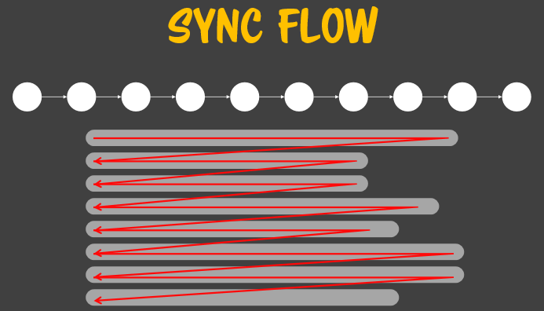
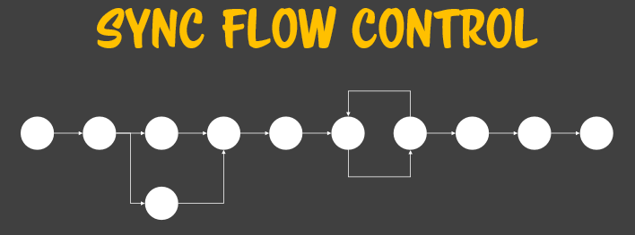
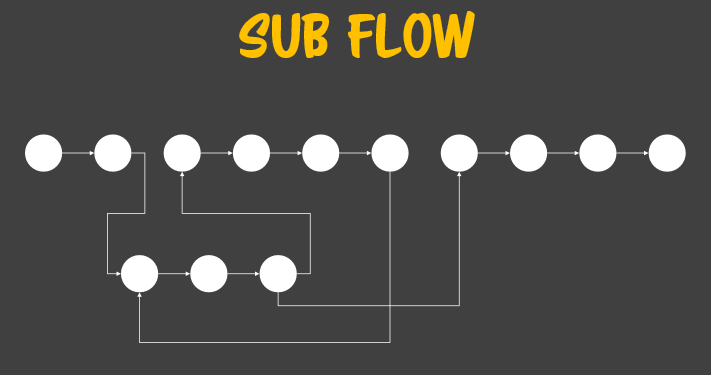

## Flow

**폰 노이만 머신이 메모리에 적재된 프로그램을 소비하는 과정을 flow 라고 부른다.** 이 flow는 메모리에 적재된 순서대로 한번에 진행되고 끝나며 개발자는 실행 중간에 관여하지 못하게 되어있다.

**한번에 적재된 메모리의 명령을 관여없이 소비하는 과정을 동기화과정**(sync)라고 하며 이러한 형태의 명령을 동기화 명령이라 한다. 이 과정을 관여할 수 있게하는 다양한 기법들을 비동기성이라고 한다. 동기화 명령 구조에서 실제로 적재되어 있는 프로그램은 기계어로 되어 있어 소비하면 되지만, 인간은 랭귀지 코드로 코딩한다. 랭귀지 코드에서 기계어 코드와 매칭되는 형태로 코드를 짜기위한 기본규칙이 **LR 파서 규칙**이다.


### Sync flow



**위에서 아래로, 왼쪽에서 오른쪽으로 순서대로 실행되는 것이 Sync flow 이다**. 단, 예외가 있는데 그것은 바로 대입연산자 `=` 이다. assignment라고도 하는데 이것만이 유일하게 오른쪽에서 왼쪽으로 동작한다. 왜 이렇게 되었냐면, 그것은 언어 설계자들이 전부 수학자여서 이러한 방식을 선호했기 때문이다. 사칙 연산을 하는 연산자 `+, -, *, /` 도 마찬가지이다. 그래서 연산자를 사용할 때에도 연산자 순서를 의존하기보다는 `( )`괄호를 써서 명확하게 코딩을 해야 한다. 수학자들만이 할 수 있는 연산자 순서에 따른 코딩보다는 사소한 수식이라 할지라도 `( )` 를 쓰거나 함수로 바꿔서 사전없이도 쉽게 알수 있게 코딩을 해야 한다.

복잡성을 정복하기 위해서는 쓸데없는 함정은 다 막아야 한다. 함정은 다 막는 방어적 코드를 만들어야 하는데, 이것을 **Certain code** 라고 한다. 자바스크립트는 아직 없으나 명확한 코딩이 중요하므로 습관을 들이도록 한다.


### Flow control statement 

컴퓨터는 무조건 끝까지 실행해버리고 실행 중 개입이 불가한 폰 노이만 머신의 특징을 가지고 있다.  프로그램은 외부에 입력을 받지 않으면 실행할 때마다 언제나 같은 결과가 나오며 프로그램의 변화가 전혀 없어서 효용성이 없어진다. 그래서 외부에서 입력을 받는 것으로 프로그램이 반응하게 만들 것이다. 이것이 프로그램의 기본적인 전략이다. 

입력값은 고정적인 프로그램을 계속 다르게 들어올 수 있는 여지를 만들어 준다. 입력에 따라서 실행되는 절차가 똑같이 실행될 수도 있지만, 다른 플로우를 타게 하고 싶다면 어떻게 해야할까? 그떄 사용하는것이 **flow contrl statement**이다.



flow control statement 은 폰 노이만 머신의 플로우 제어를 도와준다. 이것을 이용해 sync flow control을 할 수 있다.


### Sub flow

flow control 뿐만 아니라 sub flow를 만들기도 한다. 반복되는 로직이 있을 경우 sub flow 를 만들어 main flow에서 sub flow를 중간에 거칠 수 있게 한다. sub flow control은 보통 statement로 하지  않고 함수나 클래스 호출로 처리한다. 



이 전체는 모두다 sync flow control 맥락안에 있다. statement로 하는 것은 일반적인 normal flow를 여러가지로 관리하거나 점프하는데 쓰이는 것이고, 반복해서 어떤 flow를 사용하고 싶을 때 sub flow로 빼서 쓴다. sub flow는 다시 sub flow로 뺄 수 있다. 위의 그림에서 동그라니 하나가 문 또는 식이라면, 이것을 조직화하는 방법이 flow control 이다.


### Generator

ES6의 제네레이터는 플로우를 중간에 중단시킬 수 있다. 그리고 다른 플로우를 진행하다가 중단된 곳부터 다시 진행할 수 있다. 플로우가 죽 진행되는데, 이렇게 하나의 세트가 진행되는 것을 **루틴**이라고 부른다. 특히 전체 flow에 대한 루틴은 한번만 돌지만, sub flow는 여러 번 돌 수 있다. 이것을 **서브 루틴**이라고 부른다. 서브 루틴은 여러번 돌 수 있다. 일반적인 루틴의 특징은 진입하고 나서 끝까지 실행되고 빠져나간다. 단, 코루틴의 경우 여러번 들어가고 여러번 빠져나갈 수 있는데, 이러한 복잡한 플로우 제어가 es6에도 포함되어 있다. 현대화된 프로그래밍 언어에서는 흐름제어가 훨씬 더 발전되었다.


### 인공언어의 표현력

프로그래밍 언어는 인공 언어라고 볼 수 있는데, 왜 동일한 기능을 하는 for, while. dowhile이 있으며 if, switch가 있는 것일까?  그것은 코드로 복잡한 사람의 의도와 생각을 표현하기 위해 다양한 수단을 제공하는 것이다. 그래서 코드를 작성 할 때 의도를 충분히 표현하도록 작성하고 수정이 필요할 때 코드를 읽어보면 이걸 왜 이렇게 작성했는지 이해시킬수 있다. 다른 입문 강좌에서는 그것이 변수에 있다고 하지만, 그렇지 않다. 의도는 어떤 제어문, 문을 어떻게 사용해서 알고리즘을 표현하는가로 나타난다. 대충 막 코딩을 하게 될 경우 동작만 하면 끝인 방식으로 코드를 짜게 된다. 하지만 변화가 필요할 경우에 굴러만 가는 코드에는 의도가 표현되어 있지 않아 수정을 할 수 없게 된다.

따라서 제어문을 배우는 가장 기초적인 단계에서부터 해당 제어문이 무엇을 의미하는지 섬세하게 느끼고 섬세하게 표현할 줄 알아야 한다. 비록 실무에서는 바빠서 막 쓰긴 하겠지만, 섬세한 표현을 할 줄 모르면 엄한 짓을 하게 된다. 최고 수준으로 섬세하게 표현할 수 있는 감각을 익히면 업계에서도 통용이 된다. 또한 제어문을 섬세하게 쓰지 못하면 나중에 객체를 만들거나 함수를 만들어 통신을 할 때 섬세하게 쓰는 방법을 알지 못하게 된다. 그래서 처음 배울 때부터 섬세한 언어의 이용방법과 의미를 고민해보고 본인만의 세계를 만드는 게 중요하다.

만약 여유가 있어 개발에 급급하지 않는 레벨에 올라가면 모든 코드가 보여서 선수들끼리는 읽기가 편하게 된다. 선수가 되기 위해서는 선수들이 쓰는 언어를 써야 한다. 선수들은 JS를 표현력 있게 사용한다. 	


### If 문

제어문을 익히는 단계는 바른 문법이 무엇인지 정확하게 이해해서 신기해 보이지 않도록 하는 것이 첫 시작이다. 그것이 바르게 제어문을 배우는 것이다.

if문의 형식은 if문 뒤에 공백문자가 올수 있다. 공백은 무한히 올 수 있다. 공백 문자의 특징은 공백 문자가 여러 개가 있어도 하나의 공백 블럭으로 본다. 제어문은 자바스크립트엔진에게 주는 힌트이니까 철저하게 엔진이 무엇이 제어문인지를 굉장히 명확하게 정의해 놓았다. 

```javascript
// if바로 뒤 공백 문자
// 단문이 올수 있는 자리에는 중문(블록)도 올수 있다.
if (ex:식) statement 단문
if (ex:식) {statement 중문} 

// ex 안에만 유일하게 공백 문자 안에 개행문자가 포함될 수 없다.
if (ex:식) { st } else st
```


**괄호`( )` 의 3가지 의미**

- 산술 연산식에서 우선순위 연산자로 쓰인다.
- 제어문에 들어가는 형식 기호이다. `if( )` 에서 if문인지를 판단하는 근거이다.
- 함수를 호출할 때, 호출식 연산자로 쓰인다.


### if else문과 그 의미

if문이라는 게 있지만, if else 문도 있다.

```javascript
if(/*값식*/) 3;/* <= 값식인 식문 */ 
else 5; /*<= 값식인 식문*/
```

if문은 괄호 안의 식이 참이라면, 괄호 다음의 문이 실행될 것이라는 것을 의미한다. 우리는 이 조건을 optional 이라고 부른다. 이 문장은 참일 때만 실행이 된다. if문 뒤에 있는 문이 선택적이라는 것이다.  반면에 if else일 경우에는 둘 중 하나는 절대로 실행된다. 즉 mandatory 문장인 것이다.  **if를 쓰면 선택적인 문장이라는 것을, if else를 쓰면 여러 경우 중 반드시 하나를 선택해야 하는 중요한 문장**인 것이다. 
