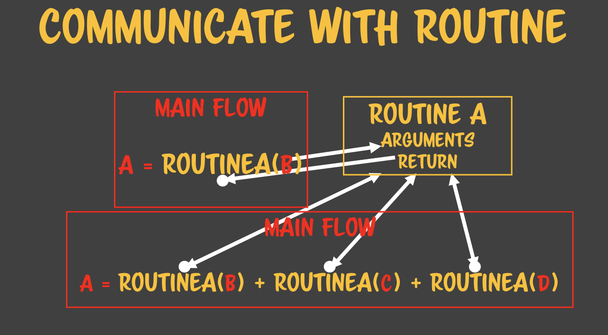
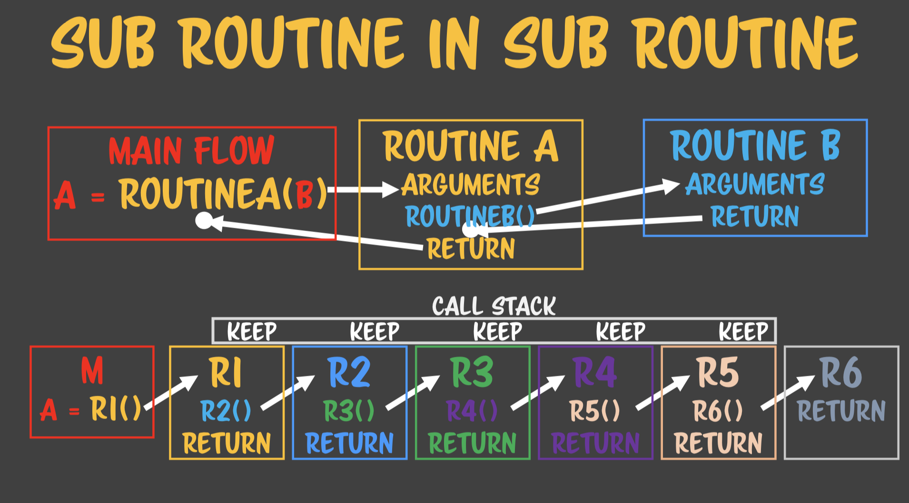

# 코드스피츠 1강

개발쪽 각 일반명사들은 전부다 고유명사이다. 따라서 이러한 고유명사들을 다 외워야 한다. 각 고유명사들을 명확하게 설명할 수 있고, 기억해야 한다. 학습하는 과정은 여기 도메인에 나오는 모든 고유명사들을 명확하게 설명할 수 있으면 도메인을 정복한 것이다. 


루틴 : 반복해서 사용하기 위한 코드가 따로 있는 것으로 한번이 아니라 여러번 플로우가 흐를수 있는 곳을 말한다. 

서브루틴 :

플로우 : 

먼저 메인 플로우가 있다. 메인 플로우 도중에 루틴이라는 것을 부른다. 어떻게 실행될까? 메인플로우가 처음에 그냥 흐르다가, 루틴 호출 구문을 만나면, 곧장 루틴쪽으로 흐름제어를 보낼 것이다. 그 다음에는 루틴 A의 흐름이 흐르게 된다. 그러면 루틴에 있는 이 플로우가 다 끝났을 때 돌아오게 된다. 그 돌아오는 지점이 루틴을 호출한 그 지점으로 돌아간다.  

그 다음에 다음 루틴을 호출하고, 다시 돌아오고 메인 플로우를 빠져나와서 프로그램이 종료가 된다. 프로그램은 기본적으로 플로우를 타고 흘러서 사라진다. 그때 서브루틴이 서브플로우를 만들어낸다. 서브 루틴을 하나의 컴퓨터다 라고 켄트백은 부른다. 서브루틴에 담을수 있는 세계는 컴퓨터 한대 분량이다. 즉 완전한 로직이 다들어갈 수 잇다. 이 함수 하나의 무게는 가벼울 수도 무거울 수도 있는 것이다. 모든 로직이 다 들어올 수 잇기 때문이다. 그래서 우리는 함수를 만들때 고심을 해야 한다. 아니면 함수가 폭발적으로 커질 수 잇다. 폭발적으로 커지면 관리가 안된다. 폭발적으로 커질수 잇는 이유는 함수 안에 컴퓨터 한대를 다 넣을 수 있기 때문이다.




단지 서브루틴으로 플로우 제어를 넘기는 것만 하는 것이 아니다. 서브루틴은 여러번 반복해서 도는데, 똑같이 돌기만 하면 그 유용성이 떨어진다. 구구단을 예로 들자면 인자 하나만 받으면 그 인자에 따른 구구단을 만들어내는 함수가 각 구구단을 개별적으로 출력하는 함수들 보다 더 유용할 것이다. 인자에 제네릭한 로직을 짜는 생각을 발명해낸 것이다. 인자로 들어온 단에 제네릭한 알고리즘을 만들어 낸 것이다. 제네릭? 일반화된 알고리즘을 만들어낸 것이다. 특화되지 않고 인자가 뭐가 들어오든지 대응할 수 있는 로직을 짜는데 성공한 것이다. 인자에 제네릭한 알고리즘을 고안해낼 수 잇다면 함수의 유용성이 굉장히 높아지고 이 실력이 부족할 수록 비슷한 함수를 더 많이 만들어 낸다. 

복잡한 상황에는 이것이 쉽지 않다. 예를 들면 로그인 이라는 함수를 보자. 카톡 로긴, 페북 로긴, 라인 로긴, 구글 로긴 등을 만들라고 시키면 각각의 로긴에 따라 다 로긴 함수를 만들어 낼 것이다. 하지만 실력이 된다면 하나의 로긴 함수를 어떠한 인자에 대해서도 대응할 수 잇는 로직을 짤수 있을 것이다. 이것이 바로 알고리즘을 얼마나 복잡할 때 인자에 대해서 제네릭하게 짤수 있는 실력이 있냐 없느냐의 문제이다. 즉 개념은 쉽지만 개인차가 크게 일어나는 것이다 .

업계에 가보면 비슷한 로그인을 처리하는 것을 수십개 만들어서 사용하는 회사들도 많다. 함수를 만들 때 인자에 대해서 제네릭한 알고리즘을 짜는데 성공했기 때문에 메인 플로우와 서브 루틴이 인자로 대화할수 있게끔 인자의 개념을 만들어내는 데 성공했다. 

첫번쨰 커뮤니케이션, 메인플로우와 서브 루틴간의 커뮤니케이션은 서브루틴을 호출하는 쪽에서 인자를 통해 전달해 준다. 서브 루틴으로. 서부루틴에게 인자를 통해서 전달한다. 

괄호를 통해 호출하는 것은 알골60에서 비롯되었지만, 그후의 모던 언어에서는 대괄호, 괄호없이 호출하는 언어들도 많다. 중요한 것은 루틴을 부르는 구문이 언어마다 있다는 것이다. 서브루틴을 부르는 구문이 괄호에 종속되지 않는 다는 것을 알 필요가 있다. 모던 랭귀지일수록 괄호 없는 서브루틴 호출을 선호한다.

우리는 인자를 주고, 리턴되는 값을 받는다. 우리는 서브루틴을 2가지로 나눈다. 리턴값이 오는것 안오는 것인데, 안 오는 경우에는 이 루틴이 있는 자리에 아무것도 대입이 되지 않는다. 오는 경우는 리턴한 값이 대입이 될 것이다.  자바스크립트는 무조건 리턴값이 있다. undefined가 무조건 온다. 하지만 랭귀지에 따라서는 리턴되는 값이 없는 것을 지원하는 경우도 있다. 이런 것을 특별하게 분류하기 위해서 함수는 값을 리턴하는 타입, 값을 리턴하지 않는 타입을 프로시저라고 부르기도 한다. 그래서 개념적으로 보자면 값을 리턴하는 것은 함수, 그렇지 않는 것은 프로시저라고 부른다. 자바스크립트는 전부 값을 리턴하는 함수이지만 프로시저 흉내를 throw를 통해서 할수 잇다. 그러면 리턴하지 않는다. 

루틴은 여러 번 호출된다. 루틴이 메인 플로우와 대화하는 것을 보면 인자로 주어서, 결과값을 원래 호출한 자리에 통째로 대체해 버린다. 루틴을 호출한거를 통째로 호출한 결과로 대체가 된다. 

```javascript
A = ROUTINEA(B) + ROUTINEA(C) + ROUTINEA(D); 
```

LR파서 이기 때문에 대입만 제외하고는 왼쪽에서 오른쪽으로 핵석한다. 로직이 왼쪽에서 오른쪽으로 흐른다. 왼쪽부터 발동이 시작된다. 왼쪽부터 각 루틴호출 구문은 전부 리턴값으로 대체가 될 것이다. 그리고 operand라는 개념이 있기 때문에 왼쪽 두개의 합이 먼저 계산이 된다. 연산자로 나오지는 않지만, + 라는 루틴으로 볼 수 있다. 괄호가 루틴이라고 단정을 짓지 말아야 한다. 속성을 불러도, 할당을 하기만 해도 함수를 호출할 수 있다고 했다.  +기호만 써도 사실은 +함수에2개의 인자를 전달하는 일이 일어난다. 그러면 그 전체가 +의 결과값인 하나의 값으로 대체된다. 함수는 괄호를 통해 호출한다는 선입견을 가지고 있으면 많으 ㄴ것이 함수로 보이지 않는다. 루틴으로 보이지 않는다. 루틴의 형태를 굉장히 다양할 수 있다는 것을 예상할 수 잇어야 한다  . 연산자도 루틴이다. 연산자는 특이하게 생긴 루틴이다. 함수가 가운데 있고 인자를 양쪽에 다가 받는다. 다 초창기 수학자들이 만들어서 그렇다. 루틴의 호출이 통일되지 않고 그렇게 연산자를 그리 만들었고, 이 연산자도 결국 루틴의 호출이다. 그렇게 각각 값이 다 여산되면 그 값이 A에 할당될 것이다. 루틴 A를 어딘가에 기록하지 않고 루틴 B를 호출하면 두개의 루틴 값을 합칠수 있을가? 합칠수 없다. 어딘가 메모리에 변수에 값을 담아둬야 그 두개를 합산해서 결과값을 구할수 잇다. 그래서 더하기를 할 때에는 첫번째 인자값을 저장할 메모리가 필요하다. 그리고 2번째 인자를 계산해서 합산해서 값을 구한다. 그리고 그 후에 또 덧셈이 있으면 그에 대한 메모리가 필요하게 되는 것이다. 함수의 호출은 인자의 가짓수, 수에 따라서 추가적으로 메모리를 요구하는 경우가 있다. 이러한 모든 메모리를 스택 메모리라고 부른다. 필요없는 메모리를 해제할 수 잇다. 필요없어서 해제한 다음 그 다음 로직에서 다시 쓰이면 되니까 메모리를 하나만 사용할 수 있게 된다. 그런 면에서 필요한 만큼 잡았다가 필요없으면 해체하는 방식을 스택 메모리라고 부르는데 그 방식으로 작동하게 되어 있다.  서브루틴이 어떻게 해서 다른 플로우나 호출하는 쪽과 통신을 하는지를 이야기 했다. 서브루틴을 부르는 쪽에서는 원하는 바를 표현하기 위해서 인자를 전달하고, 서브루틴은 자신의 결과를 돌려주기 위해서 리턴을 사용한다.


상대적인 관점

어떤 사람이 있다고 하자. 기준점에 따라서 뚱뚱한지, 날씬한지 판단을 달리할 수 있다. 마찬가지로 윈도우 입장에서는 브라우저는 어플리케이션이다. 하지만 자바스크립트 코드입장에서는 브라우저가 OS라고 볼수 있을 것이다. 이런 것이 상대적인 관점의 기준점이다. 그러면 우리는 서브 루틴과 메인 플로우가 아니다. 서브루틴을 호출하는 쪽과 호출당하는 쪽을 상대적인 관점에서 보자. 그러면 호출 당하는쪽은 서브루틴, 호출하는 쪽은 메인플로우라고 이야기 할 수 잇을 것이다. 그렇다면 더이상 메인 플로우와 서브루틴의 차이점은 없다. 단지 상대적이다. 누가 호출했고 당했고의 입장만 있을 것이다. 이 개념은 컴사 전반에 만연되어 있다. 부모 클래스도 자식클래스일수 잇고 자식클래스도 다른 클래스의 부모클래스일수 잇다. 이렇게 모든 개념들이 상대적이기 때문에 가장 중요한 것은 상대적인 입장을 판별하는 기준점이 무엇인지 명확하게 인식하는 것이다. 루틴을 파악할 때 특히 중요한 것은 누가 호출했고 누가 호출 당했는지 이다. 함수에는 다양한 속성들이 존재한다. 오늘 배우는 것은 루틴의 서브루틴의 속성을 배우는 것이다.

처음의 흐름은 루틴 A로 넘어간다. 여기서 다시 루틴 B로 넘어가게 되면 흐름제어는 루틴 B로 넘어가게 된다. 하지만 메모리를 다 해제해버리면 arguments는 누가 기억하겠는가? 그러니 루틴 A영역을 메모리로 유지를 하고 있어야 한다. 기존의 내용들을 기억하려면 그렇게 해야 한다. 그래야 보존되어서 다른 서브루틴으로 안심하고 넘어갈 수 있는 것이다. 함수 관련된 메모리 전체를 킵한다. 여러가지 컨텍스트가 존재한다. 걔네들을 다 얼려놓고 갔다오는 것이다. 갔다 오면 비로소 킵했던 것을 활성화 시킬 수 잇을 것이다. 거기서 다 연산이 끝나고 나면 다시 리턴되어서 메인플로우로 넘어올 것이고 루틴은 종료되어서 메모리를 유지할 필요가 없게 될 것이다. 서브루틴에서 서브루틴을 호출하게 되면 중간 다리 역할하는 서브루틴의 메모리를 얼려두는 일이 일어난다. 이것이 어려운 이유는 디버깅 하는 시점에 서브루틴의 메모리가 해제되어 있기 때문이다. 그래서 디버깅이 어렵다. 문제는 이미 서브루틴이 다 끝난 시점인 메인 플로우 시점에서 파악하려고 하기 때문이다. 누구 잘못인지 판정하기 어렵다. 서브루틴에 서브루틴으로 호출하면 이런 문제가 존재한다.



여러개를 호출하게 되면 문제가 더 복잡해진다. 각각의 서브루틴을 호출하면서 호출한 쪽에서는 메모리를 유지시킨다. 이러면 적어도 5개의 메모리를 얼려두고 와야 하는 것이다. 컴퓨터에 메모리를 다 감당할 수 있느냐가 문제가 될 것이다. 이것이 바로 함수안의 함수를 연쇄에 대해서 제한할 수 잇는 이유이다. 이 원리에 의해서 메모리 제약이 걸리는 것이다. 함수를 무한히 연쇄할수가 없다. 메모리 문제가 존재하기 때문이다. 

자바스크립트에서는 함수 호출 중첩이 100번이상되면 죽여버릴래 라는 정책을 가지고 있다. 정책이 없다면 메모리가 꽉차서 죽어버린다. 함수를 연쇄할때 주의해야 하는점은 메모리 고갈이 일어나지 않도록 적당히 해야 한다. 33분51초

 