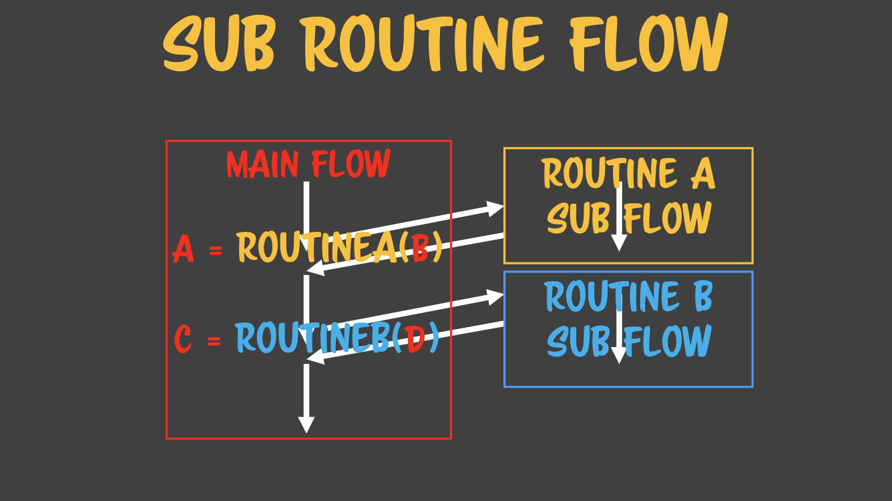
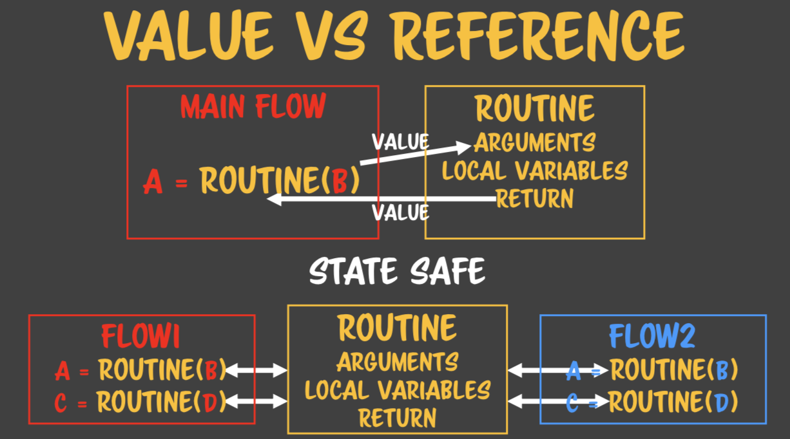

# 코드스피츠 1강

>  개발쪽 각 일반명사들은 전부다 고유명사이다. 이러한 고유명사들을 명확하게 기억하고 설명할 수 있어야 한다.

- 루틴 : 반복해서 사용하기 위한 일련의 코드들로, 여러번 플로우가 흐를 수 있다.
- 서브루틴 : 루틴과 거의 유사한 의미로 특정한 과업을 행하기 위한 일련의 코드들이다.
- 플로우 : 폰노이만 머신이 메모리에 적재한 코드를 실행하는 과정을 말한다.
- 제네릭 프로그래밍 : 컴퓨터 프로그래밍 중 하나로 타입에 따라서 알고리즘이 작성된다.


<br/>


## SUB ROUTINE FLOW



메인 플로우에서 루틴A을 호출하게 되면 루틴A 쪽으로 플로우 컨트롤이 가게 될 것이다. 루틴 A에서 플로우가 진행되다가 끝이 나면 루틴 A를 호출한 그 지점(포인터)로 돌아오게 된다. 그 후에 루틴 B도 호출해서 플로우가 루틴 B로 갔다가 다시 돌아오게 되면 메인플로우를 빠져나와서 프로그램이 종료가 된다. 

프로그램은 기본적으로 플로우를 타고 흐르다가 종료되어 사라진다. 서브 루틴은 서브플로우를 만들어 낸다. 유명한 소프트웨어 엔지니어인 켄트 벡은 서브루틴을 하나의 컴퓨터라고 부른다. 즉 완전한 로직이 컴퓨터 한대 분량으로 들어갈 수 있다는 의미로 우리는 함수를 만들때 많은 고민이 필요하다. 급격하게 커지는 함수는 관리가 힘들기 때문이다.

<br/>

## COMMUNICATE WITH ROUTINE


서브루틴은 여러번 반복해서 실행이 되는데, 동일하게만 실행되면 유용성이 떨어지니 인자의 개념을 만들어 내어 인자에 대해서 제네릭한 로직을 짜는 방식을 발명해 냈다. 인자에 제네릭한 알고리즘을 고안할 수 있다면 함수의 유용성이 많이 높아지게 된다. 

메인 플로우와 서브루틴은 인자로 커뮤니케이션을 할수 있게 되었다. 메인플로우와 서브 루틴 간의 커뮤니케이션은 서브루틴을 호출하는 쪽에서 인자를 통해 전달해 준다. 즉 서브루틴을 부르는 쪽에서는 원하는 바를 표현하기 위해서 인자를 전달하고 서브루틴은 자신의 결과를 돌려주기 위해서 return을 사용한다.

서브루틴을 호출하는 데 괄호를 이용한 것은 Algol60에서 비롯되었지만, 그 후의 모던 랭귀지에서는 괄호 없이 호출하는 언어들도 많다. 중요한 것은 서브루틴을 부르는 구문이 언어마다 있다는 것이다. 서브루틴을 부르는 구문이 괄호에 종속되지 않는 다는 것을 알 필요가 있다. 오히려 모던 랭귀지에서는 괄호 없는 호출을 선호한다.

  

### 2가지 서브루틴

서브루틴은 2가지로 나뉠 수 있다. 리턴 값이 오는 것과 안 오는 것인데, 오지 않을 경우에는 해당 루틴이 있던 자리에 아무것도 대입이 되지 않는다. 리턴값이 오는 경우에는 리턴한 값이 대입이 될 것이다. 자바스크립트는 무조건 리턴 값이 있는데, 리턴 값이 없을 경우에는 undefined가 리턴되기 때문이다. 하지만 자바스크립트의 경우에도 throw를 통해서 리턴하지 않도록 유사하게 만들수 있다.  

개발 언어에 따라서 리턴되는 값이 없는 것을 지원하는 경우도 있다. 이것을 분류하기 위해서 리턴 값이 없는 것을 **프로시저**, 리턴 값이 있는 것을 **함수**라고 부르기로 했다.

  

### 함수와 스택메모리

루틴은 여러 번 호출된다. 메인 플로우가 루틴과 대화하는 것을 보면 인자를 루틴에게 줬다가 리턴 값을 원래 호출한 자리에 대체해 버린다. 

```
A = RoutineA(B) + RoutineA(C) + RoutineA(D)
```

기본적으로 LR파서에 따르기 때문에 대입만 제외하고 왼쪽에서 오른쪽으로 구문을 해석하며 흐름도 마찬가지이다. 왼쪽에서부터 각 루틴 호출 구문은 전부 리턴값으로 대체가 될 것이다. 또한 oprand라는 개념이 있기 때문에  RoutineA(A1), RoutineA(A2) 의 합이 먼저 계산이 된다. `+`도 루틴으로 볼 수 있다. 괄호, 함수 만이 루틴이라고 단정짓지 않도록 한다. getter & setter처럼 속성을 부르거나, 할당을 하기만 해도 함수를 호출할 수 있다. 여기서는 `+` 기호를 써서 +함수에 2개의 인자를 전달하는 일이 일어나는 것이다. 그 후에 하나의 값으로 대체가 된다.

함수는 괄호를 통해 호출한다는 선입견이 있다면 많은 것이 함수로, 루틴으로 보이지 않는다. 루틴의 형태는 굉장히 다양할 수 있다는 것을 예상할 수 있어야 한다. 연산자는 특이하게 생긴 루틴이다. 각각의 값들이 계산된 후에 Result에 할당 될 것이다.

여기서는 RoutineA를 3번 호출하고 있다. 먼저 계산된 값을 기록하지 않고 다음 루틴을 호출하게 되면 두개의 루틴 값을 합칠수가 없다. 메모리 어딘가에 값을 담아둬야 두개를 합산해서 결과값을 구할수 있다. 그래서 더하기를 할 때는 첫번째 인자값을 저장할 메모리가 필요하다. 그리고 2번째 인자를 계산한 후에 합산해서 값을 구한다. 그 후에 또 덧셈이 있으면 그에 대한 메모리가 필요하게 되는 것이다.

함수의 호출은 인자의 가짓수, 수에 따라서 추가적으로 메모리를 요구하는 경우가 있다. 이런 모든 메모리를 **스택메모리** 라고 부른다. 스택메모리에서는 필요한 만큼 잡았다가 필요가 없으면 해제를 한다. 

  

### 상대적인 관점

어떤 사람이 뚱뚱한지 날씬한지는 기준에 따라서 판단이 달라질 수 있다. 마찬가지로 윈도우 입장에서는 브라우저는 어플리케이션이지만, 자바스크립트 코드 입장에서는 브라우저가 OS라고 볼 수 있다. 이러한 상대적인 관점을 호출하는 쪽과 호출당하는 쪽에 대입해보자. 그러면 호출 당하는 쪽은 서브루틴, 호출하는 쪽은 메인 플로우라고 볼 수 있다. 결국 남는 것은 호출하는 쪽과 호출 당하는 쪽만 남게 된다. 이러한 개념은 컴퓨터 사이언스 전반에 만연되어 있다. 부모 클래스와 자식클래스도 대표적인 예이다. 이렇게 많은 개념들이 상대적이기 때문에 가장 중요한 것은 **상대적인 입장을 판별하는 기준점이 무엇인지 명확하게 인식**하는 것이다. 

<br/>

## SUB ROUTINE IN SUB ROUTINE


처음 흐름은 루틴 A로 넘어간다. 거기서 다시 루틴 B로 넘어간다. 루틴 B로 넘어갔을 때 루틴 A 영역을 메모리로 유지하게 된다. 기존의 내용들을 기억하려면 그렇게 해야 한다. 그래야 보존되어서 다른 서브루틴으로 안심하고 넘어갈 수 있는 것이다. 함수 관련된 메모리 전체를 유지한다. 그렇게 얼려놓고 갔다 온 다음에 다시 유지한 영역들을 활성화 시키는 것이다. 서브루틴에서 서브루틴을 호출하게 되면 중간 다리 역할하는 서브루틴의 메모리를 이렇게 얼려두게 된다.

디버깅이 어려운 이유는 이미 서브루틴이 다 끝난 시점인 메인 플로우 시점에서 문제를 파악하려고 하기 때문이다. 디버깅을 하는 시점에는 서브루틴의 메모리가 다 해제되어 있어서 어떤 부분의 잘못인지 알아내기가 힘들다. 서브루틴에서 다시 서브루틴을 호출하면 이런 문제가 존재하게 된다.


여러 개를 호출하면 문제가 더 복잡해진다. 각각의 서브루틴을 호출하면서 호출한 쪽에서는 메모리를 유지시킨다. 위의 그림에서는 적어도 5개의 메모리를 얼려두고 와야 한다. 그렇다면 컴퓨터에서 메모리를 다 감당할 수 있느냐가 문제가 될 수 있다. 이것이 바로 함수안의 함수 연쇄를 제한하는 이유이다.

자바스크립트에서는 함수 호출 중첩 횟수가 제한되어 있다. 만약 정책이 없다고 할지라도 메모리가 꽉차서 죽어버린다. 함수를 연쇄할 때 주의해야 하는 점은 메모리 고갈이 일어나지 않도록 적당히 해야 한다는 것이다. 이것들이 합쳐진 것이 콜 스택이라는 메모리이다. 콜(호출) 할 때마다 메모리에 쌓여가기 때문이다. 함수 루틴의 연쇄는 콜 스택을 유도한다. 스택이기 때문에 마지막 함수로부터 메모리가 차근차근 해제될 것이다.

제어형 구문을 지원하는 모든 언어에서는 예외없이 콜스택이나 재귀를 줄여야 한다. 예를 들어 함수 연쇄가 100회라고 하자. R99까지 함수 연쇄를 만들었고, R99까지 호출되어 있는 상황에서 다른 함수 A()를 호출하거나 A()안에서 누가 R99까지 함수 연쇄를 실행해버린다면 프로그램이 죽어버릴 것이다. 이것이 중대한 문제가 되는 이유는 테스트에 걸리지 않기 때문이다. 하지만 마지막 시스템 통합 테스트에서는 문제가 생겨버린다. 틀린 곳이 없는데 문제를 고칠수가 있을까? 이것이 콜 스택을 쌓았을 때 일어날 수 있는 굉장히 무서운 문제이다. 나중에 out of memory가 일어나도 고칠수가 없다. 그러니 처음부터 스택을 쌓지 않도록 주의하지 않으면 어느 순간 프로그램이 죽어버릴 수 있는 것이다.

이러한 문제를 예방하기 위해서 제어형언어를 사용할 때에는 콜스택을 줄이는 습관을 들이도록 한다. 그것은 콜스택을 어떻게든 줄이거나 for, while문으로 바꾸는 전략을 진행하는 것을 말한다. 콜 스택의 무서움을 잘 인지하자.

<br/>

## VALUE VS REFERENCE



**값**은 그 값이 무엇이냐에 따라서 식별된다. 값이 다를 경우에만 식별이 된다. 숫자 3과 숫자 3은 같기 때문에 식별되지 않는다. 값의 특징은 값의 크기로 식별이 된다. 값의 크기로 식별되지 않는 다면 그것은 값이 아니다. 

**참조**는 메모리 주소로 식별한다. 우리는 메모리 주소를 이용해서 같은지 다른지 식별하는 것들을 참조라고 부른다. 어떤 타입이 값인지, 참조인지는 언어가 정한다. 값 타입이 아닌 애들은 전부 참조이다. 루틴과 대화하는 인자와 결과값이 값이냐 참조이냐에 따라서 여러가지 일이 일어난다. 

```javascript
const a = new Number(3);
const b = new Number(3);
const c = 3;
const d = 3;

console.log(a === b); 	// false
console.log(c === d); 	// true
```

  

### 인자가 값타입일 때

값 타입에서 가장 중요한 속성은 할당이 일어날 때마다 복사가 일어난다는 것이다. 인자로 넘어간 값, 반환되는 결과값이 전부 복사가 된다. 언제나 복사본을 넘기기 때문에 원본과 관계가 없어진다. 이것이 바로 값 타입을 선호하는 이유이다. 복잡한 구조체나 클래스 조차도 값으로 보낼 수 있는 언어들도 존재한다. 값 타입인 것이 중요하지, 문자나 숫자인 것이 중요하지 않다.

언어에서는 루틴을 호출할 때 인자에 보내면 인자를 할당한 것과 똑같이 취급한다. 루틴에 보낼 인자에 할당한 것이다. 그래서 할당과 동일하게 복사본이 만들어진다. 리턴도 마찬가지로 해당 루틴을 호출했던 그 지점인 포인터에 할당하는 것이다. 할당하는 행동일 때 값 타입이면 복사본이 넘어간다. 서로 아무런 관계없이 완전히 다른 애들을 바라보고 로직이 돌아가는 것이다.

만약 플로우1과 플로우 2가 루틴을 공유하는 형태라고 가정해 보자. 이런 경우 동시성이라는 문제를 일으켜서 플로우 1이하는 동안 플로우 2가 호출할 수도 있다. 하지만 동시에 호출해도 아무런 문제가 없다. 복사본을 받아서 복사본을 주기 때문이다.  함수의 가장 이상적인 형태는 값타입을 받아서 값 타입을 반환하는 것이다. 그렇게 하면 호출 순서, 호출 횟수에 모두 영향을 받지 않는다. 이러한 것을 상태안전(state safe)라고 부르며 순수함수, 수학적 함수라고도 부른다.


인자가 참조로 넘겨질 때, 참조는 값의 복사는 아니기 때문에 루틴의 인자로 넘겨진 B와 루틴 내부에서 받은 인자가 동일한 대상을 참조를 하게 된다. 이렇게 참조로 사용하다보면 메모리상에 동일한 대상을 참조하는 대상들이 늘어나는데, 이것을 감염(infection)이라고 부른다. 한번 참조가 만들어지면 계속 감염이 늘어나게 된다. 그러다가 만약 B의 데이터를 바꾸게 되면 그 여파는 B의 데이터를 참조하는 모든 대상들에게 미치게 된다. 그래서 루틴에서 받아온 참조에 무언가 변화를 줄 때는 최악의 경우가 되는 것이다. 게다가 이러한 변화는 눈으로는 보이지 않는다. 

자바스크립트는 참조를 안전하게 사용할 수 있는 안전장치가 없기에 최대한 정책적으로 Readonly로 사용해야 한다. 즉 참조로 넘어온 인자는 무조건 Readonly로 처리해야 하는 것이다.  만약 setter가 있어서 변경이 가능하더라도 Readonly로 사용하자. 리턴 값으로 참조가 넘어가는 경우에는 얼핏 보면 루틴이 참조를 반환하고 루틴은 메모리에서 사라질 테니 아무 문제가 없다고 생각할 수 있다. 하지만 그 참조가 만들어 질 때 그 참조를 인자, 지역 변수가 물어버리는 경우가 생긴다. 또 그 참조를 반환할 참조가 다시 물어버리는  경우도 있다. 값 타입의 경우에는 참조를 내장할 수 없기 때문에 이런일이 생기지 않는다.

```javascript
const a = new Number(3);
a.test = function(){console.log('hello');}
a.test();

// a 라는 참조가 다른 참조도 가지게 된 것이다.
// 값은 이렇게 할수 없다. 다만, 자바스크립트의 숫자, 문자 등은 박싱이 되기 때문에 할당이 가능해 보이기도 하지만 호출은 되지 않는다.

const value =undefined;
value.test = function() {console.log('value');}
// VM485:3 Uncaught TypeError
```

  


리턴할 참조 객체가 다른 참조를 물어버리기도 하고 참조 인자를 물어버리면 리턴할 참조 객체 안에서 인자를 변형시킬수도 있다. 그래서 우리가 참조로 값을 반환하고 싶다면 전부다 새로운 객체를 써야하고 arguments는 Readonly일 뿐만 아니라 참조에 들어가서도 안된다. 이렇게 해야 참조로 값을 반환했을 때 안전한 상태(state safe)가 될 수 있다.

이렇게 인자의 참조, 리턴의 참조에 대한 전략을 가지고 짜는 습관을 가져야 대규모 프로그래밍에서 신경 쓸 부분을 많이 줄여주고, 버그가 여러가지를 감염시키는 것을 막아준다.

고급개발자가 되면 에러처리에 대한 실력이 굉장히 중요해진다. 60년간 통계를 보면 우리가 개발하는 시간은 전체 개발 시간 중에 10%에 지나지 않는다. 나머지는 디버깅 타입으로 되어있다. 따라서 개발시간은 거의 디버깅이라고 봐도 된다. 

디버깅이 어려운 이유는 이러한 수칙들을 다 예외로 만들기 때문이다. 디버깅이 유리해 질려면, 어떤일이 누구한테 생겼는지를 한정 지을수 있어야 한다. 디버깅 타임을 줄이는 것이 고급개발자로 가는 길이다. 실제 단위 시간 대비 더 많은 것을 만들 수 잇는 개발자이기 때문에 이러한 습관을 처음부터 기르는 것이 실무적인 개발자가 되는 길인 것이다. 언어가 허용한다고 다 쓰면 안된다.

좋은 함수를 짜는 것은 좋은 코드를 짜는 것의 첫 걸음이다. 초보개발자가 첫번째로 통과해야 할 관문이기도 하다.

<br/>

## STRUCTURED DESIGN


프로그래밍 계의 고전학자는 Larry Constantine의 Structured Design이다. 이 책에는 결합도, 응집도를 통해서 소프트웨어를 평가하는 체계적인 분류가 있다. 이 사람이 소프트웨어 품질은 낮은 결합도와 높은 응집도에 달렸다는 평가 사고 방식을 고안해 냈다. 그는 함수 내부가 어떻게 만들어야 잘 만들어진 것인가에 대한 지침으로 **응집도**를, 여러 개의 함수가 어떤 식으로 관계를 맺어야 하는지에 대해서는 **결합도**라는 개념을 만들었다.

<br/>

## 결합도 모델

### content - 강결합

**A클래스 속성 v가 변경되면 즉시 B클래스가 깨짐**

이 구조의 문제점은 A클래스에서 this.v의 v를 다른 것으로 변경하는 순간 B는 깨져버린다. 내부를 직접 참조하거나 내용을 공유하고 있기 때문에 강한 결합이 일어난다. A의 변화가 B에 얼마나 데미지를 주느냐에 따라서 강한 결합인지 아닌지가 판가름난다.

강결합이에 A를 수정할 수가 없다. A와 결합된 애들이 여파를 여디까지 받을지 알수 없기 때문이다. 이 때 여파란 의존하고 있는 다른 부분들이 받게 될 효과이다. A의 여파는 A를 참조하고 있는 모든 부분에 끼치게 된다. 여파를 계산하기 전까지는 변경할수가 없다. 이렇게 함수군에 참조를 만들면 안된다.

개발 실력이 좋으면 요구 사항 변경, 추가에 대해서 큰 신경을 쓰지 않는다. 변경에 의한 여파가 없기 때문이다.

```javascript
class A {
  constructor(v) {
    this.v = v;
  }
}

class B {
  constructor(a)
  {
    // this.v에 a.v를 바로 가져온다.
    // 클래스 A의 인스턴스인데, 이것의 속성을 직접 참조하고 있다.
    this.v = a.v;
  }
}

const b = new B(new A(3));
```

  

### Common - 강결합

**common 클래스 변경시 즉시 A, B클래스가 깨진다.**

common, util 등의 공통 클래스가 존재한다. common 이라는 클래스를 A, B클래스가 각각 참조를 한다. 컨텐츠 결합이기 때문에 common을 건드리는 순간 A, B가 둘다 깨지게 된다. 이러한 의존성 결합 때문에 여파는 더욱 커지게 된다. 이 감염은 사방에 퍼져 있게 된다.

```javascript
class Common {
  constructor(v) {
    this.v = v;
  }
}

class A {
  constructor(c) {
    this.v = c.v;
  }
}

class B {
  constructor(c) {
    this.v = c.v
  }
}
```

  

### External - 강결합

**A클래스의 변경을 A클래스 내부에서 완화할 수단이 있다.**

getter로 호출한다는 점만 제외하면 컨텐츠 결합과 같다. 외부 결합이 컨텐츠 결합과 다른 점은 class A의 this.v 에서 v를 변경할 수 있다는 점이다. B의 코드를 변경하지 않고 A를 변경할 수 있는 수단이 주어지는 것이다. 얼마나 감싸느냐에 따라서 변화할 수 있는 폭이 달라진다. 내부의 변화를 외부에서 감출 수 있는 중간층을 둔다는 개념이 외부 결합이다. 외부에서는 노출된 외부 사정만 가지고 참조를 한다. 그래서 좀더 결합이 약해졌다. 하지만 getValue는 결합성이 있어서 변경할 수 없다.

```javascript
class A {
  constructor(v) {
    this.v = v;
  }
  getValue() {
    return this.v;
  }
}

class B {
  constructor(a) {
    this.v = a.getValue();
  }
}

const b = new B(new A(3));
```

  

### Control - 강결합

**A클래스 내부의 변화는 B클래스의 오작동을 유발**

컨트롤 결합은 A에서 범용함수가 존재한다. 앞의 외부결합, 컨텐츠 결합, 커먼 결합까지는 사용해서는 안되는 결합이지만, 컨트롤 결합 부터는 os, api등에서 사용되고 있다. 자기 통제권이 있고, 변화가 적다면 쓸수도 있는 결합이다. 보통 첫번째 인자가 플래그인 경우가 많다. 그런데 이 플래그로 값이 들어와야 한다. 참조가 아니기 때문에 A와 B가 참조로 결합되지 않아 결합이 약해진다.

문제는 플래그에 대한 의존성이 생기기 때문에 내부 구조를 변경할 수 없다. 플래그의 값을 바꿀수 없기 때문에 플래그의 의존성도 나쁘다. 플래그 값 변경을 할수 없고 플래그 개선시에도 영향을 받기 때문이다. 

이것을 컨트롤 결합이라고 부르는 이유는 외부 플래그를 이용해서 내부 플로우 컨트롤에 관여하기 때문이다. 그래서 의존성은 심하지만, 편의상 사용한다.

```javascript
class A {
  process(flag, v) {
    switch(flag) {
      case 1: return this.run1(v);
      case 2: return this.run2(v);
      case 3: return this.run3(v);
      default: return console.log("None");
    }
  }
}

class B {
  constructor(a) {
    this.a = a;
  }
  noop() {
    this.a.process(1);
  }
  echo() {
    this.a.process(2, data);
  }
}

const b = new B(new A());
b.noop();
e.echo("test");
```

  

### STAMP - 강결합 or 유사약결합

**A와 B는 ref로 통신함. ref에 의한 모든 문제가 발생할 수 있다.**

스탬프 결합은 참조 객체를 보내서 대화를 하게끔한다. 참조를 가져와서 그 참조의 내부 값을 변경해 줘야 할때 쓰는 결합이다. 스탬프가 될 수 있는 노트가 있다면 거기에 도장을 찍어서 다시 돌려주는 개념이다. 실무에서 여러가지로 사용되는데, 대표적으로 값 객체를 돌려쓰는 경우가 있다. 스탬프 결합은 객체지향에서 좀더 자세히 다룰 것이다.

```javascript
class A {
  count(v) {
    v.count++;
  }
}

class B {
  constructor(a) {
    thius.a = a;
    this.counter = {count:0};
  }
  count() {
    this.a.count(this.counter);
  }
}

const b = new B(new A());
b.count();
b.count();
```

  

### DATA - 약결합

**A와 B는 value로 통신함. 모든 결합문제에서는 자유로워짐.**

이 데이터 결합을 제외한 다른 결합들은 전부 강결합이다. 약결합은 인자로 값을 넘기고, 리턴값으로 값을 받는다. 그래서 복사본만 넘어가므로 결합이 일어날 수 없다. this.a.count에도 값이 넘어가고, this.counter에 할당이 된다. 아무런 사이드 이펙트가 없는 가장 약한 결합이다. A는 값을 보낼 수만 있다면 누구든지 결합할 수 있다.

가장 약한 결합인 데이터 결합은 값 타입으로 대화하는 형태이다. 따라서 우리는 데이터 결합을 지향해야 하고 참조를 사용할 때에는 굉장히 조심해야 한다.

```javascript
class A {
  const(v) {
    return ++v;
  }
}

class B {
  constructor(a) {
    this.a = a;
    this.counter = 0;
  }
  count() {
    this.counter = this.a.count(this.counter);
  }
}

const b = new B(new A());
b.count();
b.count();
```

  


결합도 모델은 아래로 갈수록 약결합이 된다. 결합도는 함수를 디자인할 때 인자와 결과값을 어떻게 주고 받을지에 대한 것이다.  결합도 모델이 함수들 간의 관계라면, 함수 내부에서는 응집도 모델이 있다. 응집도는 함수 내부를 어떻게 만들어야 좋은 것인지에 대한 내용이다. 

일반적으로 결합도가 높으면 나쁘지만, 결합도가 높은 애들이 대부분 응집도가 높다. 마찬가지로 결합도를 낮추면 응집도도 낮아진다. 그럼 우리가 2개의 모순점에서 도메인을 잘 파악해서 그 균형점에서 결합도는 낮추고 응집도는 높이려고 노력하는 것이다. 고급 개발자가 필요한 부분이 이렇게 밸런스를 맞추는 부분이다. 결합도 문제 때문에 맨 처음의 coincidental을 제외하고는 사용을 한다. 여러명이 협력하다보면 결합도를 낮추는 것이 최우선 작업이 되는데, 한명이 망치면 심각한 영향을 받기 때문이다. 

<br/>

## Role Of Sub Routine

### Coincidental

**아무런 관계가 없음 다양한 이유로 수정됨**

Util안의 메소드들이 유틸 안에 있는 이유는 그저 우연일뿐이다. 여러가지가 다 들어가 있기 때문에 유틸은 계속 갱신될 것이고 갱신될때마다 수정된 부분의 여파가 어떤지 알수 없기에  다같이 단위 테스트를 해야 하며 갱신 후의 배포까지 생각한다면 여러모로 큰 비용이 들게 될 것이다. . 이렇듯 관련없는 부분들을 모아놓으면 관리가 힘들고 큰 리스크를 가지게 된다. 

```javascript
class Util {
  static isConnect(){}
  static log(){}
  static isLogin(){}
}
```

  

### Logical

**사람이 인지할 수 있는 논리적 집합. 언제나 일부만 사용됨**

로직이라는 것은 사람이 생각하기에 말이 되는 것인데, 이것은 문화권에 따라서 로직이 안될 수 있다. 로직은 컨텍스트 하에서 서로 합의하는 것으로 로지컬하게 묶여있다는 것은 굉장히 약한 개념인 것이다. 또한 이용하려는 대상이 전체의 일부라는 점이 큰 문제이다. 즉 사용하기 위해 묶어둔 것이 아니기 때문에 필요하지 않는 기능, 메서드등도 다 같이 묶여 있게 되어 이후 수정을 하게 될 때도 여파를 같이 받게된다. 게다가 로직을 만들고 나면 로직에 포함되지 않은 유사 로직 객체를 또 만들어야 한다. 즉 Math로직과 Math2 로직이 생기는 것이다. 이렇기에 약한 응집도이다.

```javascript
class Math {
  static sin(r){}
  static cos(r){}
  static random(){}
  static sqrt(v){}
}
```

  

### Temporal

**시점을 기준으로 관계없는 로직을 묶음. 관계가 아니라 코드의 순서가 실행을 결정. 역할에 맞는 함수에게 위임해야 한다.** 

약한 응집도이지만 가장 많이 등장한다. 대표적으로 initialize, start 등이 있으며 시점 기준으로 묶인다. 개발자가 만든 로직이 순차, 순서에 의존하는 로직을 만들면 이것은 피할수가 없다. 하지만 이러한 개념에는 단일 실행 머신이 있다. 지금과 미래에는 병렬 실행 머신을 이용한 병렬 실행을 하게 된다면 순서에 비의존적인 형태로 알고리즘을 갱신할 수 있어야 한다. 구구단을 병렬 알고리즈믕로 바꿔서 동시에 처리하게 할수 있는가?

초기화 뿐만 아니라 회원가입, 로그인 등에서도 수나처리가 일어난다. 아무 상관이 없지만 시간순서로 묶이는데 이것들은 정책 인 것이다. 시점을 기준으로 하면 왜 이런 순서로 구성되어 있는지 코드만 봐서는 설명이 되지 않는다는 점이다.

```javascript
const App = class {
  init() {
    this.db.in init();
    this.net.inint();
    this.asset.init();
    this.ui.start();
  }
}
```

  

### PROCEDUAL

**외부에 반복되는 흐름을 대체하는 경우. 순서 정책 변화에 대응 불가**

프로시저에서는 절차적으로 처리한다. 첫번째 절차가 리턴 값을 주면 그 값으로 그 다음 절차가 진행되고 그 리턴값으로 다시 그 다음 절차가 진행되는 식이다. 시점 기준의 것보다는 좀더 코드의 의도가 명확하지만 이것도 절차적 프로그래밍을 가정하고 있다. Structured design 책은 오래되어 절차지향적 디자인에 후한 점수를 주지만 병행 처리에는 맞지 않다.

```javascript
class Account {
  login() {
    p = this.ptoken();
    s = this.stoken(p);
    if(!s) this.newLogin();
    else this.auth(s);
  }
}
```

  

### COMMUNICATION

**하나의 구조에 대해 다양한 작업이 모여있다.**

커뮤니케이션 모델에서는 좀더 응집도가 높아졌다. Array 라는 자료구조에서 하는 일들이 비슷한데 원소 처리에 대해서 비슷한 연산들을 지원하고 있다. 이때부터 클래스와 메소드 느낌이 나기 시작한다. 이들 메소드 간에는 관계가 거의 없고 어떤 데이터와 대화를 할뿐이다. 그래서 통신형 모듈을 쓰게 된다.

```javascript
class Array {
  push(v){}
  pop(){}
  shift(){}
  unshift(v){}
}
```

  

### SEQUENTIAL

**실행순서가 밀접하게 관계되며 같은 자료를 공유하거나 출력 결과를 연계됨**

이 모델은 인자도 받지 않고 리턴도 없으며 this의 상태를 갱신해 주기만 한다. 순서가 있기는 하지만, 입출력을 통하지 않고 공통의 상태를 갱신하면서 커뮤니케이션을 한다. 응집도가 높기는 하지만 객체의 구조를 바꾸게 되면 전부 영향을 받고 순서상으로 먼저번의 메소드를 수정해도 다 깨질 것이다. 물론 그 여파는 해당 클래스 안에서만 한정될 것이다. 내부의 상태를 갱신해 가면서 전진을 하는 굉장히 강한 응집도의 모듈들이 뭉쳐져 있다. 그래서 이 코드의 내부 사정은 이 코드 안에서 다 해결이 되는 것이다. 코어시스템, os 등 내부를 못 건드리게 응집도가 되게 높은 코드들을 보면 바깥쪽에 노출된 인터페이스는 일반적으로 결합도가 높다. 

```javascript
class Account {
  ptoken() {
    return this.pk || (this.pk = IO.cookie.get('ptoken'));
  }
  stoken() {
    if(this.sk) return this.sk;
    if(this.pk) {
      const sk = New.getSessionFromPtoken(this.pk);
      sk.then(v=>this.sk);
    }
  }
  auth() {
    if(this.isLogin) return;
    Net.auth(this.sk).then(v+>this.isLogin);
  }
}
```

  

### FUNCTIONAL

**역할모델에 충실하게 단일한 기능이 의존성 없이 생성된 경우**

이 모델을 달성할 수 있으면 완성되는 것이다. 이번 코드 스피츠74에서 추구하는 것도 이 모델의 응집도를 어떻게 만들어 가느냐가 관건으로 지향하는 바이다.

<br/>

## 1강에서 다룬 이야기들

1. 루틴의 기본개념
2. 서브루틴이 어떻게 작동하는지
3. 루틴이 커뮤니케이션을 할때 인자와 결과값을 어떻게 주고 받는지, 
4. 서브루틴안의 서브루틴이 호출되었을 때 문제들 
5. 함수를 잘 짜기 위해서 결합도와 응집도 모델을 어떻게 이용해야 하는지

에 대한 개념을 잡았다. 다음주에는 루틴의 심화버전을 다루기로 한다.