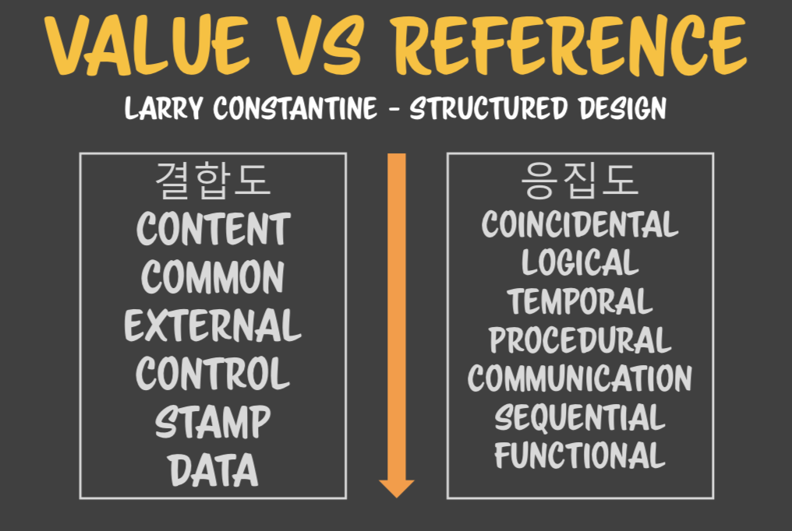

# 코드스피츠 1강

개발쪽 각 일반명사들은 전부다 고유명사이다. 따라서 이러한 고유명사들을 다 외워야 한다. 각 고유명사들을 명확하게 설명할 수 있고, 기억해야 한다. 학습하는 과정은 여기 도메인에 나오는 모든 고유명사들을 명확하게 설명할 수 있으면 도메인을 정복한 것이다. 


먼저 메인 플로우가 있다. 메인 플로우 도중에 루틴이라는 것을 부른다. 어떻게 실행될까? 메인플로우가 처음에 그냥 흐르다가, 루틴 호출 구문을 만나면, 곧장 루틴쪽으로 흐름제어를 보낼 것이다. 그 다음에는 루틴 A의 흐름이 흐르게 된다. 그러면 루틴에 있는 이 플로우가 다 끝났을 때 돌아오게 된다. 그 돌아오는 지점이 루틴을 호출한 그 지점으로 돌아간다.  

그 다음에 다음 루틴을 호출하고, 다시 돌아오고 메인 플로우를 빠져나와서 프로그램이 종료가 된다. 프로그램은 기본적으로 플로우를 타고 흘러서 사라진다. 그때 서브루틴이 서브플로우를 만들어낸다. 서브 루틴을 하나의 컴퓨터다 라고 켄트백은 부른다. 서브루틴에 담을수 있는 세계는 컴퓨터 한대 분량이다. 즉 완전한 로직이 다들어갈 수 잇다. 이 함수 하나의 무게는 가벼울 수도 무거울 수도 있는 것이다. 모든 로직이 다 들어올 수 잇기 때문이다. 그래서 우리는 함수를 만들때 고심을 해야 한다. 아니면 함수가 폭발적으로 커질 수 잇다. 폭발적으로 커지면 관리가 안된다. 폭발적으로 커질수 잇는 이유는 함수 안에 컴퓨터 한대를 다 넣을 수 있기 때문이다.


단지 서브루틴으로 플로우 제어를 넘기는 것만 하는 것이 아니다. 서브루틴은 여러번 반복해서 도는데, 똑같이 돌기만 하면 그 유용성이 떨어진다. 구구단을 예로 들자면 인자 하나만 받으면 그 인자에 따른 구구단을 만들어내는 함수가 각 구구단을 개별적으로 출력하는 함수들 보다 더 유용할 것이다. 인자에 제네릭한 로직을 짜는 생각을 발명해낸 것이다. 인자로 들어온 단에 제네릭한 알고리즘을 만들어 낸 것이다. 제네릭? 일반화된 알고리즘을 만들어낸 것이다. 특화되지 않고 인자가 뭐가 들어오든지 대응할 수 있는 로직을 짜는데 성공한 것이다. 인자에 제네릭한 알고리즘을 고안해낼 수 잇다면 함수의 유용성이 굉장히 높아지고 이 실력이 부족할 수록 비슷한 함수를 더 많이 만들어 낸다. 

복잡한 상황에는 이것이 쉽지 않다. 예를 들면 로그인 이라는 함수를 보자. 카톡 로긴, 페북 로긴, 라인 로긴, 구글 로긴 등을 만들라고 시키면 각각의 로긴에 따라 다 로긴 함수를 만들어 낼 것이다. 하지만 실력이 된다면 하나의 로긴 함수를 어떠한 인자에 대해서도 대응할 수 잇는 로직을 짤수 있을 것이다. 이것이 바로 알고리즘을 얼마나 복잡할 때 인자에 대해서 제네릭하게 짤수 있는 실력이 있냐 없느냐의 문제이다. 즉 개념은 쉽지만 개인차가 크게 일어나는 것이다 .

업계에 가보면 비슷한 로그인을 처리하는 것을 수십개 만들어서 사용하는 회사들도 많다. 함수를 만들 때 인자에 대해서 제네릭한 알고리즘을 짜는데 성공했기 때문에 메인 플로우와 서브 루틴이 인자로 대화할수 있게끔 인자의 개념을 만들어내는 데 성공했다. 

첫번쨰 커뮤니케이션, 메인플로우와 서브 루틴간의 커뮤니케이션은 서브루틴을 호출하는 쪽에서 인자를 통해 전달해 준다. 서브 루틴으로. 서부루틴에게 인자를 통해서 전달한다. 

괄호를 통해 호출하는 것은 알골60에서 비롯되었지만, 그후의 모던 언어에서는 대괄호, 괄호없이 호출하는 언어들도 많다. 중요한 것은 루틴을 부르는 구문이 언어마다 있다는 것이다. 서브루틴을 부르는 구문이 괄호에 종속되지 않는 다는 것을 알 필요가 있다. 모던 랭귀지일수록 괄호 없는 서브루틴 호출을 선호한다.

우리는 인자를 주고, 리턴되는 값을 받는다. 우리는 서브루틴을 2가지로 나눈다. 리턴값이 오는것 안오는 것인데, 안 오는 경우에는 이 루틴이 있는 자리에 아무것도 대입이 되지 않는다. 오는 경우는 리턴한 값이 대입이 될 것이다.  자바스크립트는 무조건 리턴값이 있다. undefined가 무조건 온다. 하지만 랭귀지에 따라서는 리턴되는 값이 없는 것을 지원하는 경우도 있다. 이런 것을 특별하게 분류하기 위해서 함수는 값을 리턴하는 타입, 값을 리턴하지 않는 타입을 프로시저라고 부르기도 한다. 그래서 개념적으로 보자면 값을 리턴하는 것은 함수, 그렇지 않는 것은 프로시저라고 부른다. 자바스크립트는 전부 값을 리턴하는 함수이지만 프로시저 흉내를 throw를 통해서 할수 잇다. 그러면 리턴하지 않는다. 

루틴은 여러 번 호출된다. 루틴이 메인 플로우와 대화하는 것을 보면 인자로 주어서, 결과값을 원래 호출한 자리에 통째로 대체해 버린다. 루틴을 호출한거를 통째로 호출한 결과로 대체가 된다. 

```javascript
A = ROUTINEA(B) + ROUTINEA(C) + ROUTINEA(D); 
```

LR파서 이기 때문에 대입만 제외하고는 왼쪽에서 오른쪽으로 핵석한다. 로직이 왼쪽에서 오른쪽으로 흐른다. 왼쪽부터 발동이 시작된다. 왼쪽부터 각 루틴호출 구문은 전부 리턴값으로 대체가 될 것이다. 그리고 operand라는 개념이 있기 때문에 왼쪽 두개의 합이 먼저 계산이 된다. 연산자로 나오지는 않지만, + 라는 루틴으로 볼 수 있다. 괄호가 루틴이라고 단정을 짓지 말아야 한다. 속성을 불러도, 할당을 하기만 해도 함수를 호출할 수 있다고 했다.  +기호만 써도 사실은 +함수에2개의 인자를 전달하는 일이 일어난다. 그러면 그 전체가 +의 결과값인 하나의 값으로 대체된다. 함수는 괄호를 통해 호출한다는 선입견을 가지고 있으면 많은 것이 함수로 보이지 않는다. 루틴으로 보이지 않는다. 루틴의 형태를 굉장히 다양할 수 있다는 것을 예상할 수 잇어야 한다  . 연산자도 루틴이다. 연산자는 특이하게 생긴 루틴이다. 함수가 가운데 있고 인자를 양쪽에 다가 받는다. 다 초창기 수학자들이 만들어서 그렇다. 루틴의 호출이 통일되지 않고 그렇게 연산자를 그리 만들었고, 이 연산자도 결국 루틴의 호출이다. 그렇게 각각 값이 다 연산되면 그 값이 A에 할당될 것이다. 루틴 A를 어딘가에 기록하지 않고 루틴 B를 호출하면 두개의 루틴 값을 합칠수 있을가? 합칠수 없다. 어딘가 메모리에 변수에 값을 담아둬야 그 두개를 합산해서 결과값을 구할수 잇다. 그래서 더하기를 할 때에는 첫번째 인자값을 저장할 메모리가 필요하다. 그리고 2번째 인자를 계산해서 합산해서 값을 구한다. 그리고 그 후에 또 덧셈이 있으면 그에 대한 메모리가 필요하게 되는 것이다. 함수의 호출은 인자의 가짓수, 수에 따라서 추가적으로 메모리를 요구하는 경우가 있다. 이러한 모든 메모리를 스택 메모리라고 부른다. 필요없는 메모리를 해제할 수 잇다. 필요없어서 해제한 다음 그 다음 로직에서 다시 쓰이면 되니까 메모리를 하나만 사용할 수 있게 된다. 그런 면에서 필요한 만큼 잡았다가 필요없으면 해체하는 방식을 스택 메모리라고 부르는데 그 방식으로 작동하게 되어 있다.  서브루틴이 어떻게 해서 다른 플로우나 호출하는 쪽과 통신을 하는지를 이야기 했다. 서브루틴을 부르는 쪽에서는 원하는 바를 표현하기 위해서 인자를 전달하고, 서브루틴은 자신의 결과를 돌려주기 위해서 리턴을 사용한다.


상대적인 관점

어떤 사람이 있다고 하자. 기준점에 따라서 뚱뚱한지, 날씬한지 판단을 달리할 수 있다. 마찬가지로 윈도우 입장에서는 브라우저는 어플리케이션이다. 하지만 자바스크립트 코드입장에서는 브라우저가 OS라고 볼수 있을 것이다. 이런 것이 상대적인 관점의 기준점이다. 그러면 우리는 서브 루틴과 메인 플로우가 아니다. 서브루틴을 호출하는 쪽과 호출당하는 쪽을 상대적인 관점에서 보자. 그러면 호출 당하는쪽은 서브루틴, 호출하는 쪽은 메인플로우라고 이야기 할 수 잇을 것이다. 그렇다면 더이상 메인 플로우와 서브루틴의 차이점은 없다. 단지 상대적이다. 누가 호출했고 당했고의 입장만 있을 것이다. 이 개념은 컴사 전반에 만연되어 있다. 부모 클래스도 자식클래스일수 잇고 자식클래스도 다른 클래스의 부모클래스일수 잇다. 이렇게 모든 개념들이 상대적이기 때문에 가장 중요한 것은 상대적인 입장을 판별하는 기준점이 무엇인지 명확하게 인식하는 것이다. 루틴을 파악할 때 특히 중요한 것은 누가 호출했고 누가 호출 당했는지 이다. 함수에는 다양한 속성들이 존재한다. 오늘 배우는 것은 루틴의 서브루틴의 속성을 배우는 것이다.

처음의 흐름은 루틴 A로 넘어간다. 여기서 다시 루틴 B로 넘어가게 되면 흐름제어는 루틴 B로 넘어가게 된다. 하지만 메모리를 다 해제해버리면 arguments는 누가 기억하겠는가? 그러니 루틴 A영역을 메모리로 유지를 하고 있어야 한다. 기존의 내용들을 기억하려면 그렇게 해야 한다. 그래야 보존되어서 다른 서브루틴으로 안심하고 넘어갈 수 있는 것이다. 함수 관련된 메모리 전체를 킵한다. 여러가지 컨텍스트가 존재한다. 걔네들을 다 얼려놓고 갔다오는 것이다. 갔다 오면 비로소 킵했던 것을 활성화 시킬 수 잇을 것이다. 거기서 다 연산이 끝나고 나면 다시 리턴되어서 메인플로우로 넘어올 것이고 루틴은 종료되어서 메모리를 유지할 필요가 없게 될 것이다. 서브루틴에서 서브루틴을 호출하게 되면 중간 다리 역할하는 서브루틴의 메모리를 얼려두는 일이 일어난다. 이것이 어려운 이유는 디버깅 하는 시점에 서브루틴의 메모리가 해제되어 있기 때문이다. 그래서 디버깅이 어렵다. 문제는 이미 서브루틴이 다 끝난 시점인 메인 플로우 시점에서 파악하려고 하기 때문이다. 누구 잘못인지 판정하기 어렵다. 서브루틴에 서브루틴으로 호출하면 이런 문제가 존재한다.


여러개를 호출하게 되면 문제가 더 복잡해진다. 각각의 서브루틴을 호출하면서 호출한 쪽에서는 메모리를 유지시킨다. 이러면 적어도 5개의 메모리를 얼려두고 와야 하는 것이다. 컴퓨터에 메모리를 다 감당할 수 있느냐가 문제가 될 것이다. 이것이 바로 함수안의 함수를 연쇄에 대해서 제한할 수 잇는 이유이다. 이 원리에 의해서 메모리 제약이 걸리는 것이다. 함수를 무한히 연쇄할수가 없다. 메모리 문제가 존재하기 때문이다. 

자바스크립트에서는 함수 호출 중첩이 100번이상되면 죽여버릴래 라는 정책을 가지고 있다. 정책이 없다면 메모리가 꽉차서 죽어버린다. 함수를 연쇄할때 주의해야 하는점은 메모리 고갈이 일어나지 않도록 적당히 해야 한다. 

함수를 잘 못쓰는 이유는 기초가 안 되어 있어서 그렇다. 이것들이 합쳐져서 콜 스택이라고 하는 메모리이다. 호출할 때마다 스택에 쌓여가기 때문이다. 스택 메모리니까 R5부터 메모리가 해제 될 것이다. 그래서 스택 메모리 구조이다. 함수 루틴의 연쇄는 콜 스택을 유도한다. 스택이기 때문에 마지막 함수로부터 메모리가 차근차근 풀려나간다. 

제어형 구문을 지원하는 모든 언어에서는 예외없이 콜스택이나 재귀를 줄여야 한다. R99까지 있다고 가정해 보자. 100번째가 생기면 죽여버리는데, 만약 R99까지 호출되어 있는 상황에서 누가 R1을 호출해 버린다면 죽어버릴 것이다. 또는 다른 함수에서 R1을 호출하더라도 마찬가지로 100번의 호출이 생기기 때문이 죽어버린다. 이것이 중대한 문제가 되는 이유는 테스트에 걸리지 않기 때문이다. 멀쩡하다. 테스트 돌리면 다 통과를 해버린다. 마지막 시스템 통합 때 문제가 생겨버린다. 그때 문제가 생기면 문제를 고칠수 있을까? 고칠수가 없다. 틀린 곳이 없기 때문이다. 이것이 콜스택을 쌓았을 때 일어날 수 잇는 굉장히 무서운 문제이다. 나중에 out of memory가 일어나도 고칠수가 없다. 문제되는 곳이 없기 때문이다. 처음부터 스택을 쌓지 않도록 주의하지 않으면 그 모듈을 안에서, 안에서 ~ 호출하다보면 죽어버리는 것이다. 

그래서 우리는 제어형언어를 사용할 때에는 콜스택을 줄이는 습관, 콜스택을 for 나 while문으로 바꾸는 습관이 필요하다. 실무에서는 페이스북인 것이다. 그렇게 짜면 무조건 죽는다. 그래서 우리는 콜스택을 어떻게든 줄이거나 for, while문으로 바꾸는 전략을 진행하게 된다. 콜스택의 무서움을 알자.


값과 참조라는 것이 나온다. 값과 참조라는 개념이 필요하다. 값은 그 값이 무엇이냐에 따라서 식별되는 애를 말한다. 값이 다를 경우에만 식별되는 애들이다. 3과 3은 값이 같기 때문에 식별되지 않는다. 

```javascript
const a = new Number(3);
const b = new Number(3);
const c = 3;
const d = 3;

console.log(a === b); 	// false
console.log(c === d); 	// true
```

값의 특징은 값의 크기로 식별이 된다. 값의 크기로 식별되지 않는 다면 그것은 값이 아니다. 값의 개념은 값의 크기만 가지고 식별이 된다면 값이다. 값이 같아도 식별이 다르게 된다면 그것은 값이 아닌 것이다. 그렇다면 무엇으로 식별 할까? 메모리 주소로 식별한다. 우리는 메모리 주소를 이용해서 같은지 다른지 식별하는 애들을 참조라고 부른다. 메모리의 주소로 식별되면 그건 값이 아니다. 

무엇이 값인지는, 무엇이 참조인지는 어떻게 정해질까? 언어가 정한다. 자바스크립트에서 어떤 것이 값, 참조인지는 외워야 한다. 값 타입이 아닌 애들은 전부 참조이다. 

루틴과 대화하는 인자와 결과값이 값이냐, 참조이냐에 따라서 여러가지 일이 일어난다. 

인자를 보내는 쪽. 인자와 리턴값을 전부 값으로 보낸다고 해보자. 그러면  값 타입에서 가장 중요한 속성은 할당이 일어날 때마다 복사가 일어난 다는 것이다. 이것이 값의 특징이다. 값의 특징은 할당이 일어날 때마다 복사가 일어난다.  인자가 넘어가는 값, 반환되는 결과값이 전부다 복사가 된다. 이것이 값의 특정이다. 언제나 복사본을 넘기기 때문에 원본과 관게가 없어진다. 이것이 바로 값 타입을 선호하는 이유이다. 복잡한 구조체나 클래스 조차도 값으로 보낼수 있는 언어들도 존재한다. 그렇게 하면 무조건 복사해서 넘어가게 된다. 값인게 중요하지, 문자, 숫자인것이 중요하지 않다. 값이란 것은 값의 형태나 식별이 되고 할당할 때 복사본이 만들어진다. 인자를 넣어서 호출할 때에는 할당과 동일하게 취급한다. 

언어에서는 루틴을 호출할 때 인자에 보내면 인자를 할당한 것과 똑같이 취급한다. 루틴에 보낼 argument에 할당한 것이다. 그래서 할당과 똑같은 일이 일어난다. 그래서 복사본이 만들어지는 것이다. 리턴도 똑같이 해당 루틴을 호출했던 그 지점인 포인터에 할당하는 것이다. 할당하는 행동일 때 값 타입이면 복사본이 넘어간다. 얘네둘이 아무런 관계가 없이, 서로 완전히 다른 애들을 바라보고 로직이 돌아간다는 것이다. 

여기서 조금 더 나아가서 플로우1과 플로우2가 복잡하게 루틴을 공유하는 형태 라고 생각해 보자. 이런식으로 주고 받을 것이다 .이것이 동시성이라는 문제를 일으켜서 ,  플로우1이 하는 동안 플로우2가 호출할 수도 잇다. 동시에 호출해도 아무 문제가 없다. 루틴이 호출할 때마다 복사본을 받아서 처리한 다음 복사본을 주기 때문이다. 누가 호출을 하더라도 안정적으로 동작할 것이다. 함수의 가장 이상적인 형태는 값타입을 받아서 값 타입을 반환하는 것이다. 즉 복사본을 받아서 복사본을 반환하는 것이다. 호출 순서, 호출 횟수에 모두 영향을 받지 않으며 어떠한 방법으로 호출해도 영향을 받지 않는다. 그렇기 때문에 루틴에서 가장 좋은 방법은  값타입을 받아서 값타입을 반환하는 것이다. 복사본을 받아서 복사본을 리턴한다. 이러면 거의 문제가 안생긴다.  이것을 상태안전(state safe)라고 부른다. 또는 순수함수, 수학적 함수라고도 부른다.


인자가 참조로 넘어가는 상황이 있다.  참조는 값의 복사가 아니기 때문에 ROUTINE(B)의 B와 루틴의 인자가 동일한 대싱이 참조를 하게 된다. 메모리상에 동일한 대상을 참조하는 녀석들이 늘어간다. 이것을 감염 infection이라고 부른다.한번 참조가 만들어지면 계속 감염을 만들게 된다. 한번 참조가 만들어지면, 참조가 할당 될 때마다 계속해서 동일 대상을 가리키는 녀석들이 많아진다. 만약 B의 데이터를 바꾸었다. 그러면 그 여파는 그 대상을 참조하는 모든 대상들에게 미치게 된다. 그래서 최악은 루틴에서 받아온 참조에 무언가 변화를 줄때가 더 최악인 것이다. 게다가 이것은 안 보인다. 자바스크립트에서는 참조를 안전하게 사용할 수 있는 안전장치가 없다. 그래서 우리는 최대한 정책적으로 Readonly로 사용해야 한다. 우리가 루틴을 짤 때 주의해야 할 점은 참조로 넘어온 인자는 리드온리로 사용하자는 것이다. 리드 온리로 사용하지 않으면 그 참조를 바라보고 있는 다른 모든 참조에 그 여파가 다 전해지게 되는 것이다. 대부분 대 참사가 일어난다. 

그래서 첫번째 참조로 넘어온 인자가 있으면 리드온리로 사용합시다. 설령 세터가 있어서 우리가 변경할 수 잇을지라도. 이번에는 리턴값으로 참조가 넘어가는 경우를 생각해 보자. 얼핏 보면 루틴이 참조를 반환하고 루틴은 메모리에서 사라질 테니까 아무 문제가 없을 거라고 생각하기 쉽다. 하지만 그 참조가 만들어 질때 그 참조를 인자, 지역 변수가 무는 경우가 생긴다.  이 참조가 다시 참조를 부는 경우가 있다. 값 타입은 원래 참조를 내장할수 없기 때문에 이런일이 생기지 않는다. 하지만 참조의 경우 만들어 질때 다른 참조를 물수 있는 능력이 있다. 

```javascript
const a = new Number(3);
a.test = function(){console.log('hello')}
a.test();

// a라는 참조가 다른 참조를 물어버린 것이다. 
// 값은 이런 짓을 못한다. 다만, 자바스크립트의 숫자, 문자 등은 박싱이 되기 때문에 할당이 가능해 보이기도 하지만, 호출은 되지 않는다.

const value = undefined;
value.test = function(){console.log('value')}; 
// VM485:3 Uncaught TypeError
```


우리가 리턴할 참조 객체가 다른 참조를 물어버리는 경우가 생긴다. 여러가지를 물수 있다. 리드 온리라고 하기로 했던 인자를 물어 버리면 리턴할 참조 객체 안에서 인자를 변형시킬 수도 있다. 그래ㅔ서 우리가 참조로 값을 반환하고 싶다면 전부다 새로운 객체를 써야 하고, arguments는 리드온리일뿐만 아니라 참조에 들어가서도 안된다. 이렇게 해야 참조로 값을 반환했을 때 안전한 상태 state safe가 될 수 있다. 

리턴의 참조, 인자의 참조에 대한 전략은 이 루틴이 독립적으로 여파가 없을 거야 우리는 이 루틴이 사고를 치지 않았을 거야 라는 개념을 가지고 있을 것이다. 그렇게 짜는 습관을 들이는 것이 대규모 프로그래밍에서 신경쓸 부분을 많이 줄여주고, 버그가 여러가지를 감염시키는 것을 막아준다. 

고급개발자가 되면 에러처리에 대한 실력이 굉장히중요해진다. 60년간 통계를 보면 우리가 개발하는 시간은 전체 개발 시간중에 10%에 지나지 않는다. 나머지는 디버깅 타임으로 되엉 ㅣㅆ다. 개발시간 전부는 디버깅이라고 해도 무방하다. 90%나 되기 때문에. 코드를 짠다 == 디버깅을 한다. 디버깅이 어려운 이유는 이러한 수칙들을 다 예외로 만ㄷ르기 때문이다. 디버깅이 유리해 질려면, 어떤일이 누구한테 생겼는지를 한정지을수 있어야 한다. 그러면 그부분만 수정하면 되니까.그런데 루틴의 연쇄에서 누가 잘못했는지, 누가 참조의 규칙을 어겨서 그런 것인지, 다 관계를 파악하는게 사람에게는 상당히 어렵다. 그래서 디버깅 타임이 굉장히 오래 걸린다. 디버깅 타임을 줄이는 것이 고급개발자로 가는 길이다. 실제 단위시간 대비 더 많은 것을 만들 수 잇는 개발자이기 때문에 이러한 습관을 처음부터 기르는 것이 실무적인 개발자가 되는 길인 것이다. 언어가 허용한다고 다 쓰면 안된다

루틴들은 루틴과 관계를 맺을 수 있고, 루틴이 다른 루틴과 관계를 맺을 때, 인자와 ㄴ리턴을 사용할수 잇고ㅡ 그렇게 통신을 할 때 값과 참조에 따라서 그 양상이 복잡하게 일어난 다는 것을 알수 잇었다. 

함수는 다수의 함수가 등장하기도 하고, 함수 내부에서의 로직도 중요하다. 함수 안쪽의 로직은 어떻게 짜느냐? 함수 내부의 로직이나 인자를 받는 방법, 함수들은 어떻게 묶어놔야 좋을까? 함수는 다른 서브루틴을 부르는 역할을 하기도 한다. 다른 서브 루틴도 이런저런 함수를 부르는 역할을 수행할 수도 있다. 매크로 함수처럼.. 이런 여러가지 면들이 있어서, 함수가 무엇인지, 함수가 어떻게 구성되어 있는지 를 모른다기 보다, 문제는 어떻게 함수를 짜는 것이 좋은지를 모르기 때문에 함수의 형태는 알지만 함수를 짜지는 못하는 것이다. 

많은 입문자 수준에서 개발자로 못 넘어가는 사람들은 코드를 못짜는 것이다. 이것의 근원은 함수를 못짜는데 있다. 좋은 함수를 짜는 것은 좋은 코드를 짜는 것의 첫 걸음이다. 여러분들이 첫번째로 통과해야 할 관문이기도 하다.


프로그래밍 꼐의 고전학자는 Larry Constantine의 Structured Design이다. 이 책에는  결합도, 응집도를 통해서 소프트웨어를 평가하는 체계적인 분류를 이 사람이 만들었다. 소프트웨어의 품질이 낮은 결합도와 높은 응집도를 가진게  좋은거야 라고 평가하는 사고방식을 고안해 냈다. 그냥 이 사람이 이 개념을 고안해냈다. 이 사람은 함수 내부가 어떻게 만들어야 잘 만들어진 것인가에 대한 지침으로서 응집도라는 개념을 내세웠고, 함수가 여러개 있을 때, 각 함수가 어떤 식으로 관계를 맺어야 하는지에 대해서 결합도라는 개념을 세웠다. 그래서 함수들간에는 결합이 낮아야 하고 함수 내부에서는 응집도가 높아야 한다. 

결합도 : 함수가 여러개 있을 때, 그 함수들을 어떻게 모아 놓았느냐에 대한 문제이다. 

### content - 강결합

**A클래스 속성 v가 변경되면 즉시 B클래스가 깨짐**

이구조의 문제점은 A클래스에서 this.v의 v를 다른 것으로 변경하는 순간 B는 깨ㅑ져버린다. 조금이라도 건드리면 바로 깨진다. 직접 참조하거나 내용을 공유하고 있기 때문에 그러하다. B클래스의 this.v = a.v는 클래스 A의 코드 일부를 그냥 가져온 것이나 같다. 이럴 경우 강한 결합이 일어난다. 왜 강한 결합이라고 하냐면 A의 변화가 B에 얼마나 데미지를 주느냐의 문제이다. 속속들이 알면 강결합이 된다고 생각하면 된다. A가 조금이라고 변화가 일어나면 B가 깨지거나 버그가 발생된다. 

그래서 A를 감히 수정할 수 없다. 어디까지 A와 결합된 애들이 여파를 받을지 알수가 없어서. 이때 나온 것이 여파라는 것이다. 여파란 의존하고 있는 나머지 애들이 받게 될 효과 이다. A의 여파는 A에 참조 하고 있는 모든 애들에게 끼치게 되는 것이다. 그 래서 여파계산이 끝나기 전에는 변경을 할 수가 없다. 이것을 강결합이라고 부른다. 최악의 강결합이다. 내부를 직접 참조하는 것을 말한다. 이렇게 함수군에 참조를 만들면 안된다. 왜냐면 이것을 건드리면 깨지기 때문이다. 개발 실력이 좋으면 요구 사항 변경, 추가에 대해서 큰 신경을 쓰지 않는다. 변경해도 여파가 없기 때문이다. 기획에 맞춰서 할려면 잘 만들어야 한다.

```javascript
const A = class {
  constructor(v) {
    this.v = v;
  }
};

const B = class {
  constructor(a) {
    // this.v에 a.v를 바로 가져온다. 
    // 클래스 A의 인스턴스일텐데 이것의 속성을 직접 참조하고 있다.
    this.v = a.v;
  }
};

const b =- new B(new A(3));
```


### Common - 강결합

**common 클래스 변경시 즉시 A, B클래스가 깨진다.**

커먼, 유틸 등의 공통 클래스가 존재한다. 커먼이라는 애를 A, B가 각각 참조를 한다. 커먼과 A, B는 각각 컨텐츠 결합이기 때문에 커먼을 건드리는 순간 A, B가 둘다 망한다. 결국에 의존성 결합 때문에 여파는 더욱더 크게 미치게 된다. 이미 이 감염은 사방에 되어 있게 된다.

```javascript
const Common = class {
  constructor(v) {
    this.v = v;
  }
}

const A = class {
  constructor(c) {
    this.v = c.v;
  }
}

const B = class {
  constructor(c) {
    this.v = c.v;
  }
}
```


### External - 강결합

**A클래스의 변경을 A클래스 내부에서 완화할 수단이 있다.**

getter로 호출한다는 점만 빼면 똑같다. 컨텐츠 결합과 틀린 것은 class A의 this.v에서 v를 변경할 수 잇다. 이 변화를 한번 안에서 유예할 수 있다. class B의 코드를 변경하지 않고 A를 변경할 수 잇는 수단이 주어진다. 이것을 얼마나 감싸느냐에 따라서 변화 할수 있는 폭이 달라진다.  getValue에 class B가 직접 연결되어 있기 때문에 얘 변화의 폭은 v의 변수명을 바꾸는 것에만 가능하다. 하지만 여기에 더 많은 메소드,  추상화된 메소드를 줄수록 B에 영향을 주지 않으면서도 A내부에서 변화를 줄수 잇는 여력이 더 늘어난다. 이 안의 변화를 바깥에 안 보여줄수 있는 중간층 을 둔다는 개념이 external이다. 외부에서는 안의 사정 없이 얘가 노출한 외부 사정만 가지고 참조를 하고 있다. A가 노출하지 않는 만큼의 여력을 변경해도 B는 영향을 받지 않으니까 결합이 약간 약해졌다. 하지만 getValue는 변경할 수 없다. 여전히 경합성이 있기 때문이다. 

```javascript
const A = class {
  constructor(v) {
    this.v = v;
  }
  getValue() {
    return this.v;
  }
};

const B = class {
  constructor(a) {
    this.v = a.getValue();
  }
}

const b = new B(new A(3));
```


### Control - 강결합

**A클래스 내부의 변화는 B클래스의 오작동을 유발**

제어결합은 A에서는 범용함수가 존재한다. 이 앞 결합까지는 쓰면 안되는 결합이다. 하지만 제어결합부터는 os 나 api에서 사용되고 있다. 자기 통제권에 있고, 변화가 적다면 쓸수도 잇는 패턴이다. 첫번째 인자가 플래그인 경우가 많다. 그런데 이 플래그로 값으로 들어와야 한다. 참조가 아니다. 왜냐하면 값으로 들어오기 때문에 A, B가 참조로 둘이 결합하지 않는다. 그래서 연결이 약해진다. 

문제는, A의 프로세스에[ 넘길때 , 안에서 2일때 다른 거 실행시키면 어떻게 할 것인가? A의 process  안의 구조를 변경할 수 잇다. 플래그에 대한 의존성이 생기기 때문에 안의 구조를 변경할 수 없다.  그래서 플래그의 의존성도 나쁜 것이다. 플래그 값을 못 바꾸기 때문이다. 플래그를 개선할 때도 영향을 받는다. 이렇게 메서드 전체에 영향을 주거나 플래그 때문에 의존성이 생기는 부분은 있지만, 그나마 값이니까 참조관계가 복사본이 넘어가서 약해진다. 

그래서 왜 제어라고 부르냐면 외부 플래그를 이용해서 내부 제어에 관여하기 때문이다. 플로우 컨트롤에 관여하기 때문에 그렇다. 그래서 여전히 의존성은 심하지만, 편의상 사용하기 시작한다. 

 ```javascript
const A = class {
  process(flag, v) {
    switch(flag) {
      case 1: return this.run1(v);
      case 2: return this.run2(v);
      case 3: return this.run3(v);
    }
  }
};

const B = class {
  constructor(a) {
    this.a = a;
  }
  noop() {
    this.a.process(1);
  }
  echo(data) {
    this.a.process(2, data);    
  }
};
  
const b = new B(new A());
b.noop();
e.echo("test");
 ```


### STAMP - 강결합 or 유사약결합 

스탬프 결합은 아까는 값을 보내는데, 지금은 참조 객체를 보내서 대화를 하게끔 만든다. 카운터라는 객체를 갱신해준다. 참조를 가져와서 그 참조의 내부 값을 변경해 주니까 안티패턴이 아니냐 라고 하지만, 어쩔수 없는 경우들이 존재한다. 그런 경우에 쓰는 결합인데, 스탬프가 될수 잇는 노트가 있다면 거기에 도장을 찍어서 다시 돌려주는 개념이다. 이 패턴들은 실무 예제에서 여러가지로 사용된다. 대표적으로 값 객체를 돌려쓰는 경우가 그렇다.  카운트는 값을 받은 거에 카운트 변수만 변경한뒤 돌려주었다. 그것은 이 v객체의 전부를 쓰지 않을 가능성이 높다. 스탬프 결합은 객체지향에서 좀더 자세히 다룰 것이다. 

```javascript
const A = class {
  count(v) {
    v.count++;
  }
}

const B = class {
  constructor(a) {
    this.a = a;
    this.counter = {count:0};
  }
  count() {
    this.a.count(this.counter);
  }
}

const b = new B(new A());
b.count();
b.count();
```


### DATA - 약결합

**A와 B는 value로 통신함. 모든 결합문제에서는 자유로워짐.**

7번째 패턴을 제외한 패턴들은 전부 강결합이다. 약결합은 인자로 값을 넘기고, 리턴값으로 값을 받는다. 결합이 일어날 수 없다. 왜냐하면 복사본만 넘어가기 때문이다. this.a.count에도 값이 넘어가고, 그 결과값도 다시 복사되어 this.counter에 할당이 된다. 아무런 사이드 이펙트가 없는 가장 약한 결합이다. A는 누구랑만 쓸수 있는게 아니라 누구든지 결합할 수 잇다. 아무하고나 결합할수 잇다. 값을 보낼수만 있다면 말이다. 

가장 약한 결합은 데이타 결합이라 부르고 값으로 대화하는 형태이다. 우리가 지향해야 할 것은 데이타 결합이며 참조를 사용할 때에는 굉장히 조심해야 한다. 

```javascript
const A = class {
  count(v) {
    return ++v;
  }
}

const B = class {
  constructor(a) {
    this.a = a;
    this.counter = 0;
  }
  count() {
    this.counter = this.a.count(this.counter);
  }
};

```




지금까지 본것을 결합도 모델이라고 한다.  아래로 갈수록 약결합이 된다. 이것이 함수들간의 관계라면, 내부에서는 응집도 모델이라는 것이 있다. 방금전까지는 함수들간의 인자를 주고 받는 데 주력 - 인자와 결과값을 주고 받는 방법이 결합도와 굉장히 큰 관계가 잇었다. 함수 디자인 할때 어떤 식으로 인자를 주고 받고,  결과값을 주고 받을지에 대한 고민이 결합도라면, 응집도는 함수 내부를 어떻게 만들어야 좋은거야 라는 내용이다.


## Role Of Sub Routine


### Coincidental

**아무런 관계가 없음 다양한 이유로 수정됨**

Util안의 메소드들이 유틸안에 있는 이유는 단순하다. 그냥 우연이다. 우연히 이 업무를 한 사람이 한명이라서, 우연히 다 넣기로 생각해서이다. 뭐가 문제일까? Util.js라고 한다면, 몇백명에게 배포되어 캐시로 되어 있다. 갱신하려면 큰 비용이 들것이다. 네트웤 비용, 갱신 비용등 많은 비용이 들것이다. 로그 정책, 로그인 정책 등이 바뀔 때머ㅏ다 갱신해줘야 하고 캐시 문제 일어난 거 다 잡아야 한다. 유틸이 시도때도 없이 갱신된다. 따라서 관련없는 애들을 우연히 모아놓으면 이 모듈이 관리가 안되고 굉장한 리스크를 안게 된다. 게다가 공통요소를 참조하고 있는 것이 있으면 어떤 애를 고칠때마다 항상 단위테스트를 다해야 하는 것이다. 걔를 건드렸을 때 어떤 일이 일어날지 모르기때문이다. 그래서 이것은 수정할 때 통째로 수정하는 일이 비슷하게 일어나는 애들끼리 뭉쳐있느냐 안 뭉쳐있느냐를 말하기 때문에 응집도라고 하는 것이다. 별 상관없는 애들이 모여있으니; 맨날 수정되고 있을 것이며 merge해야 하는 녀석일 것이다. 많은 문제를 일으킨다.  

```javascript
const Util = class {
  static isConnect(){}
  static log(){}
  static isLogin(){}
};
```


### Logical

**사람이 인지할 수 있는 논리적 집합. 언제나 일부만 사용됨**

로직. 이라는 것은 사람 사고에서 말이 되는 것이다. 그래서 문화권에 따라서 로직이 안될 수 잇다. 로직이라는 것은 원래 그렇다. 로직은 컨텍스트 하에서 서로 합의하는 것이다. 로지컬하게 묶여 있다는 것은 굉장히 약한 개념이다. 또다른 단점은 특정한 일부의 메서드만 쓸건데, 다른 애들도 다같이 딸려온다. 로직컬의 가장 큰 문제는 쓰는 애가 일부라는 점이다. 왜냐하면 우리가 사용하기 위해서 묶어둔 것이 아니기 때문이다. 필요한 것만 쓰이게 되는데 묶여 있을 이유가 없는 애들도 다 같이 묶여 있게 되는 것이다. 또한 수정이 되면 여파를 같이 받아야 한다. 더군다나 로직을 만들고 나면, 로직에 포함되지 않은 유사 로직 객체를 또 만들게 된다. 만약 Math가 이미 광범위하게 퍼져 있는 상황에서 유사 Math로직을 위해서 Math2를 만들게 된다면 이미 로지컬 하지 않게 된다. 로직이 그렇게 약하다. 그래서 약한 응집도로 보고 있는 것이다. 굉장히 약한 응집도이다.

```javascript
const Math = class {
  static sin(r){}
  static cos(r){}
  static random(){}
  static sqrt(v){}
}
```


### Temporal

**시점을 기준으로 관계없는 로직을 묶음. 관계가 아니라 코드의 순서가 실행을 결정. 역할에 맞는 함수에게 위임해야 한다.** 

이건 약하지만 가장 많이 등장하기도 한다. 대표적으로 initialize, start. 이것은 시점 기준으로 묶었다. 이것은 피할 수 없다. 개발자가 만든 로직이 순차나 순서에 의존하는 로직을 짜게끔 만들어서 그렇다. A가 된다음에 B가 되어야 해. B가 되려면 A안의 ~~~ 절차가 이루어져야 해. 그전까지는 이렇게 짜는 것은 당연하다고 생각해왔다. 하지만 미래에서는 그렇게 짜서는 안된다. 왜냐면, 단일 실행 머신이라는 개념이 있다. 순차적인 실행에는 내가 CPU 코어를 하나만 써야지 라는 개념이 녹아있는 것이다. 현대에 있는 개발자들은 코어를 여러개 쓸수 있는 방법을 강구하려면 알고리즈믕ㄹ 어떻게 고안해야 할까? 동시에 여러가지가 한꺼번에 이루어져도 되는, 순서에 비 의존적인 형태로 알고리즘을 갱신할수 있어야 한다.  

구구단을 병렬 알고리즘으로 바꿔서 동시에 여러개의 프로세스가 이일을 처리하게 바꿀수 있겠는가?

이 코드가 많이 발견된 이유는 순차처리를 기본으로 생각하고 있기 때문이다. 코어개발자가 되는 세상은 순차처리가 점점 없어지고 병렬처리로 바꿔줘야 한다. 그래서 그 개념에서 보면 점점 사라져야 하는 코드들이다. 하지만 여전히 순차적인 상태를 보전하는 로직들은 만연되어 있고, 대부분 상태머신을 기반으로 동작하기 때문에 이러한 코드들은 굉장히 많이 나온다. 이 때부터는 꼭 약한 응집도라고는 이야기 하지 않는다. 불가피 하다고 보고 있다. 관리하기 나름이다.

초기화 뿐만 아니라 회원가입이라던가, 로그인 한 이후 등에서도 순차처리가 일어나곤 한다. 아무상관 없지만 시간순으로 묶었다. 정책인 것이다. Temporal의 문제는 시점에 관계없는 애들이 묶여 있다는 것이 아니라 이 녀석들이 왜 묶여 있는지 코드로는 설명이 되지 않는 다는 점이다. 각각의 코드와 호출등에 대해서 함부로 순서를 바꿀수도 없다. 이 코드에는 순서가 왜 이렇게 되어 있는지 설명이 없기 때문이다. 그래서 좀 나은 회사는 주석을 붙이지만, 코드가 아니기에 주석은 썩어서 결국 안 맞게 된다. 그래서 이 코드의 문제점은, 이 코드안에 있는 녀석들이 왜 묶여 있는지 , 왜 이런 순서로 되어 있는지 코드로 설명할 수가 없다는 것이다. 그래서 나중에 지양하게 된다.

```javascript
const App = class {
  init() {
    this.db.init();
    this.net.init();
    this.asset.init();
    this.ui.start();
  }
}
```


### PROCEDUAL

**외부에 반복되는 흐름을 대체하는 경우. 순서 정책 변화에 대응 불가**

프로시저에서는 절차적으로 처리한다. 

첫번째 절차가 리턴 값을 주면 그 값으로 두번째 절차가 진행되고, 두번째 절차가 다시 세번째의 입력값이 되거나 그 여파를 이용하는 코드로, 순서가 명확히 정해져 있어서 코드로 보면 순서를 인식할 수 있다. 그래서 이전의 것보다 좀더 코드의 의도가 좀더 명확하다. 하지만 이것도 프로그램을 절차적으로 코딩할 것을 가정하고 있다. structured design 책 자체가 절차지향적인 디자인에 대해서 후한 점수를 주고 있다. 병행처리에서는 맞지 않다.

```javascript
const Account = class {
  login() {
    p = this.ptoken();
    s = this.stoken(p);
    if(!s) this.newLogin();
    else this.auth(s);
  }
}
```


### COMMUNICATION

**하나의 구조에 대해 다양한 작업이 모여있다.**

통신 모델에서는 좀더 응집도가 높아졌다. 아래의 메소드들은 전부 Array라는 자료구조를 가리키고 있다. 이 메소드들이 하는 일들은 거의 비슷한데, 원소들을 추가 삭제 관리 한다는 점에서 그렇다. 약간의 기능 차이가 있을뿐이지 원소 처리에 대해서는 비슷한 연산을 지원하고 있다. 응집도가 높고 이때부터 클래스와 메소드 느낌이 나기 시작하는 것이다. 하지만 이들 메소드 간에는 관계가 거의 없고 얘네들은 어떤 데이터와 대화를 할 뿐이다. 그래서 통신형 모듈을 쓰게 된다. 

```javascript
const Array = class {
  push(v) {}
  pop() {}
  shift() {}
  unshift(v) {}
}
```


### SEQUENTIAL

**실행순서가 밀접하게 관계되며 같은 자료를 공유하거나 출력 결과를 연계됨**

시퀀셜 모델은 다른 점은 인자도 안받고 리턴도 없다. 대신, this의 상태를 갱신해 주게끔 되어 있다. 얘네들은 순서가 있지만, 입출력을 통해 대화하지 않고 , 공통의 상태를 갱신함으로서 대화를 한다. 이 모델에서는 얘가 응집도가 더 높다고 이야기를 했다.  응집도가 높기는 하다. 객체의 구조를 바꾸면 다 영향을 받고, ptoken에서부터 코드 변경이 일어나면 다른 애들도 다 무너지고 하기 때문이다. 영향을 많이 받는다는 이야기는 Account의 영향이 이 클래스 안에서 해결된다는 의미이기도 하다. 아까 말했던 결합도가 높으면 나쁘다. 하지만 결합도가 높은 애들이 대부분 응집도가 높다. 일반적으로 결합도를 낮추면 응집도도 낮아진다. 그럼 우리가 2개의 모순점에서 도메인을 잘 파악하고 선택할 수 잇는 것은 되도록이면 이 균형점 내에서 응집도를 높이고 결합도를 낮추려고 노력하는 것이다. 높은 응집도의 코드가 높은 결합도를 보인다고 보이는 것은 정상이다. 무언가를 추구하게 되면 그 반대 급부가 반드시 생겨나서 그 반대급부를 제거하려고 하면 그 추구하는 것이 모순되게 된다. 왜 개발자가 필요하냐면, 고급 개발자가 필요한 부분은 이렇게 밸런스를 맞추는 부분이다. 내가 얼마나 낮은 결합도를 지향하는데 어떻게 높은 응집도를 맞출까. 어떤 모델을 사용해야 할까? 결합도 문제때문에 맨 처음 coincidental을 제외하고는 사용을 한다. 여러명이 협력하다보면 결합도를 낮추는 것이 최우선 작업이 된다. 왜냐하면 한명이 망치면 다 망하기 때문이다. 하지만 그렇게 되면 응집도까지 같이 낮아져 버린다. 그래서 코어 시스템, os등 내부를 못건드리게 응집도가 되게 높은 애들을 보면 바깥쪽의 노출된 인터페이스는 일반적으로 결합도가 높다. 플래그를 보낸다던지 등등.. 


내부의 상태를 갱신해 가면서 전진을 하는 굉장히 강한 응집도의 모듈들이 뭉쳐져 잇다. 그래서 얘네들의 사정들은 얘네들의 안에서 다 해결이 되는 것이다.  

```javascript
const Account = class {
  ptoken() {
    return this.pk || (this.pk = IO.cookie.get("ptoken"));
  }
  stoken() {
    if(this.sk) return this.sk;
    if(this.pk) {
      const sk = Net.getSessionFromPtoken(this.pk);
      sk.then(v=>this.sk);
    }
  }
  auth() {
    if(this.isLogin) return;
    Net.auth(this.sk).then(v=>this.isLogin);
  }
}
```


### FUNCTIONAL

**역할모델에 충실하게 단일한 기능이 의존성 없이 생성된 경우**

이 펑셔널 모델을 달성할 수 있으면 완성된 것이다. 우리 수업 6강에서 추구하는 것이 펑서녈 모델의 응집도를 어떻게 만들어 가느냐.가 관건이다. 앞으로 6강에 걸쳐서 최종적으로 얻게되어야 하는 스킬이다. 이것이 앞으로 지향하는 바이다.


오늘은

1. 루틴의 기본개념
2. 서브루틴이 어떻게 작동하는지
3. 루틴이 커뮤니케이션을 할때 인자와 결과값을 어떻게 주고 받는지, 
4. 서브루틴안의 서브루틴이 호출되었을 때 문제들 
5. 함수를 잘 짜기 위해서 결합도와 응집도 모델을 어떻게 이용해야 하는지

에 대한 개념을 잡았다. 


다음주에는 루틴의 심화버전을 다루기로 한다.