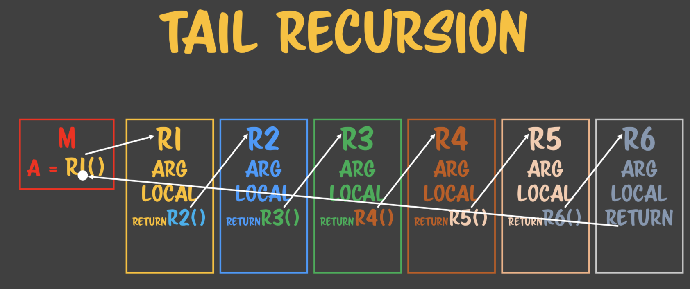
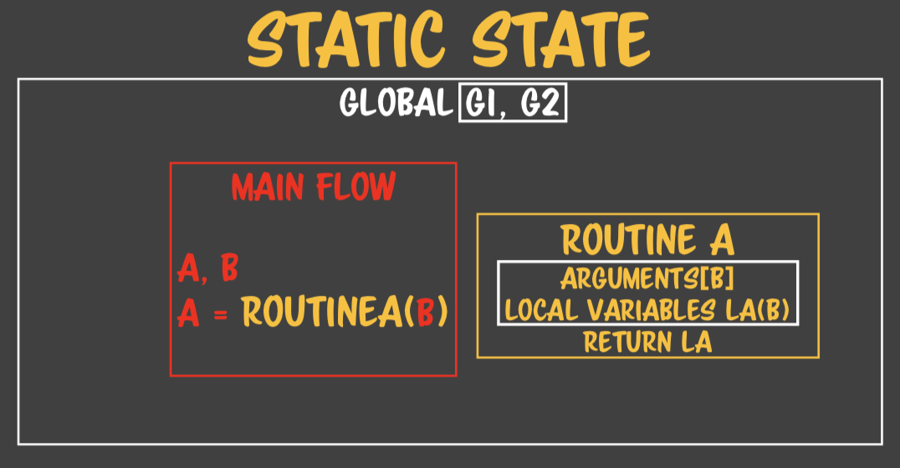
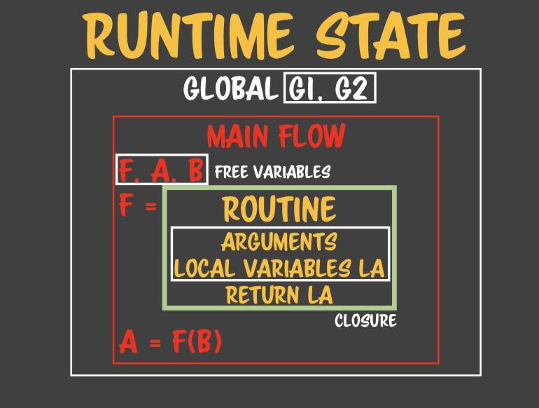
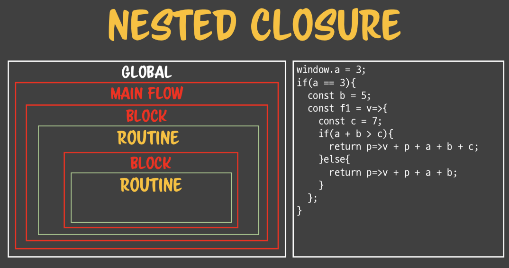

루틴을 사용할 참조가 퍼져나가는 지를 바라보자. 사이드 이펙트를 조심해야 한다.


## SPREAD REFERENCE


복사본 B가 생긴다.

지역변수에서 참조를 생성해서 반환을 하더라도 참조변수는 결국 A만 남게 되므로 아무런 사이드 이펙트가 생기지 않는다. 

이런 경우 지역변수에서 만든 객체가 특별하게 물지 않는 경우라면 참조 객체를 반환하더라도 아무런 문제가 생기지 않을 것이다.

참조 D를 인자로 넘긴다. 이럴 때 참조는 다른 참조를 물수 있는 능력이 있다. 로컬 객체가 참조 인자를 물어버린다. 이렇게 되면 C와 D가 서로 암묵적으로 연결되는 일이 벌어진다. 

참조는 한번 보내면 끊임없이 오염된다. 리드 온리를 써도 오염된다. C를 조작하다보면 D까지 변경되는 일이 생기는데, 그걸 인식조차 할수 없다. 이 함수 안을 들여다 보지 못하니까. 이때의 함수는 라이브러리의 함수가 되거나 다른 사람이 짠 함수라고 한다면 그것을 보기 힘들다.

함수를 작성할 때마다 참조에 대한 개념을 잘 알고 , 함부로 물지 않도록 조심하지 않으면 순식간에 오염이 된다. C가 계속 참조하기 때문에 D가 계속 유지되는 일이 생길수 있다.


## SUB ROUTINE CHAIN


서브루틴에 인자, 결과값을 주고 받을 때, 인자에 참조를 보내면 무조건 위험해 진다. 인자로 참조를 안 보내는게 가장 상책이다. 하지만 인자를 값 타입으로 보냈을 때 그 복사 비용이 너무 크다면 인자에 참조로 보낼 수 있다. 하지만 컴퓨터는 엄청 빠르기 때문에 웬만하면 그렇게 성능에 걸리는 경우는 잘 없다. =성능을 따지게 되는 프로그램을 만들수 있게 되면 그거 자체만으로도 축하할만한 일이다. 그러니 대부분 복사본을 보내도 된다. 명백하게 성능상에 문제가 생기는 경우는, 애니메이션 루프, 셋인터벌에 걸려있는거, 이 루프가 다시 루프안에서 쓰일거 같애, 레버리지 효과로 커질 더 같은 것은 제외하고는 다 복사본을 보내는 것이 상책이다. 

참조로 인자를 보내면, 뭐가 위험한가? 남이 짠 함수를 믿기 싫은 것이다. 함수에게 항상 복사본만 주면 된다. 함수는 대부분 자신이 만든 함수는 별로 없다. 그래서 타인의 함수가 안정적인지 아닌지 알수가 없다. 그 안정성을 믿기 싫다면 그 함수 호출 할때 복사본을 보내면 그만이다. 리액트에서 이뮤터블js를 권고하는 것도 마찬가지이다. 참조값을 보내는 것은 굉장히 위험하다.

중첩된 서브루틴을 서브루틴 체인으로 다시 배울 것이다.

콜스택이 생성되어 함수안의 함수를 계속 호출하면 스택이 쌓인다고 배웠다. 이러한 것들을 서브루틴 체인이라고 부른다. 

스택의 정체

하나의 함수안에 인자와 지역변수가 각각 존재하고 있다. 각 루틴을 부를 때마다 다 함수마다 기억해야 하는 인자와 지역변수가 있다. 그래서 스택이라고 부르는 정체는 사실 인자와 지역변수를 기억하는 것이다. 더이상 인자와 지역변수를 기억할 필요가 없으면 어떨까? 


이렇게 바꾸먀면 return에서 호출한 이후가 없다. 호출한 시점에 더이상 기억할 필요가 없다. 호출을 꼬리에 붙이면 된다. 하지만 그렇더라도 지역변수와 인자를 제외한 함수를 호출한 리턴 포인트를 기억해야 한다.  그래서 여전히 스택이 쌓이게 딘다. 스택을 제거하려면 이것들 조차 제거해야 한다. 여기서 한단계더 나아가서, 루틴들의 리턴되는 지점들을 계속 거쳐서 지나가지 말고 맨 처음의 호출 지점으로 바로 보내주면 스택이 생기지 않을 것이다. 원래 함수는 호출할 때 호출할때 결과값을 받을 포인터를 같이 넘겨준다. 루틴을 호출할 때 포인터째로넘겨주니까 스택을 잡을 필요가 없다. 그러니 막판에는 그냥 원래 포인터로 가면 된다. 몇번을 호출해도 스택이 쌓이지 않는다. 이것을 **꼬리물기최적화** 라고 부른다. 

## TAIL RECURSION



꼬리물기 최적화 로직을 사용하면 스택을 제거할 수 있다. 몇단계호출을 해도 메모리 고갈을 방지할 수 있다. 여기에는 함수의 특수한 기능이 있다. 이러한 상황이 되면 리턴 포인트까지 암묵적으로 보내주는 것이다. 하지만 이것은 언어의 엔진이 지원한다. 자바스크립트에서는 스펙에서 지원을 하지만, 웹킷에만 구현이 되어 있다. 즉 사파리에서만 가능하다. 즉 맥에서의 사파리에서만 동작한다. 

```javascript
const sum = v => v + (v > 1? sum(v-1) : 0);

sum(3); // return 3 + sum(2)
                   // return 2 + sum(!)
                              // return 1 + 0
```

이 재귀함수가 스택을 해제 할수 없는 이유는 연산스택때문이다. 이 더하기가 좌항, 우항을 더하려면 좌항 우항이 다 해결되어야 연산을 할수 있다. 그러니 더하기가 이미 스택을 물고 있는데 이것을 연산스택이라 하며 그래서 메모리를 해제할 수가 없다. 함수를 호출하는 것이 해결되기 전까지는 연산의 결과를 마무리할 수 없기 때문이다. 마지막에 함수를 호출했는데도 불구하고 연산식이 있으면 그대로 스택 메모리가 쌓이는 것이다. 마지막에 인자간 연산이나 연산자가 등장하지 않고, 순수하게 값의 연산이나 호출만 등장애야 한다. 이것을 어떻게 꼬리재귀 최적화로 바꿀 수 잇을까?

연산스택 메모리를 쓰고 있다. 함수 호출시마다 좌항에 대한 메모리를 예약해서 쓰고 잇는 것이다. 어떻게 하면 좌항에서 쓰고있는, 여산식에 쓰고 잇는 메모리를 어떻게 옮겨야 꼬리재귀최적화를 할수 있을까? 함수의 인자ㅣ 영역을 쓰는 것이다. 

```javascript
const sum = (v, prev = 0) => {
  prev += v;
  return v > 1? sum(V - 1, prev) : prev;
};
sum(3);  // return sum(2,3)
         // return sum(1,5)
         // return 6 <= 6을 바로 반환하면 된다.
```

인자 쪽으로 올겨주자. 아까는 연산식이 물고 있었는데 이제는 prev라는 변수에 옮겨주었다. 단순한 값의 함수 호출 인자 또는 값으로 떨굴수가 잇?게 되었다. 이제서야 꼬리재귀 조건을 만족했다. 연산식에 있는 메모리를 인자쪽으로 보내버렸다. 그래서 연산결과의 메모리를 다음 함수의 인자가 유지해 준다.이래서 연산식이 더이상 유지할 필요가 없다. 자신의 상태를 다 이관하는 데에는 인자로 다 넘길수 밖에 없는 것이다. 

꼬리 재귀로 바꾸는 것은 메모리에 대한 요구사항을 정리해서 다 호출에 넘겨주는 것이다. 하지만 문제는 꼬리재귀를 지원하는 것은 사파리밖에 없다. 그래서 우리는 루프로 바꿔줘야 한다. 다른 브라우저에서는 꼬리재귀 최적화가 일어나지 않아 스택 메모리가 쌓이기 때문이다. 

지원하지 않는 브라우저에서는 루프로 바꾸는 거 밖에는 답이 없다.

## TAIL RECURSION TO LOOP


재귀함수를 루프로 바꾸는 순서

1) 먼저 재귀함수를 꼬리재귀최적화로 바꾼다. 그래야 바꾸기 쉽다.  
2) prev가 유지하려는 메모리, 기록이다. 이것을 재귀호출이 아닌 지역변수로 만든다.  
3) 재귀를 발동시키는 조건을 루프의 조건으로 하면된다.  
4) 재귀함수가 하는 일을 루프 안에 넣어준다.  
5) prev를 마지막으로 반환하면 된다.

꼬리물기 최적화를 하고, 다시 루프로 바꿔줘야 한다. 큰 루프 구문을 재귀로 처리할 수 없다. 지금까지는 루프로 바꿔주어야 문제가 해결되는 것이다. 

## CLOSURE

지금까지는 정적 함수 개념을 배운 것이다. 파싱 시점에 모든 함수가 정적으로 확정되어 있는 것을 말한다. 이것은 사용할 함수가 A~z함수라면 그 26개의 함수를 정의하고 그 함수들을 더이상 건드리지 않고 26개의 함수를 호출해서 사용하겠다는 것이다. c같은 언어들이 이러한 정적함수만 사용한다. 이것은 실행중에 함수를 만들어내지 않는 다는 것을 의미한다. 보통은 자바스크립트도 정적스타일로 많이 쓰인다. 그에비해서 현대 언어들은 함수, 클래스 같은 구조체를 정적인 사용뿐만 아니라 실행도중에 만들어내는 방법을 사용한다. 

그래서 이 과정중에 부산물이 클로져 이다.

### STATIC STATE



정적 함수 관계에서 함수를 파악해 보자.루틴 에이에서 보면 지역변수와 인자만 쓸수 있다.  좀더 확장하면 전역 변수라는 것이 있다. 

정적 함수개념에서는 일반적으로 사용할 수 있는 변수의 범위가 지역변수, 인자, 전역변수 이다. 이외에는 쓸수 없다. 전역변수를 사용하면 안 좋은 점은 루틴안의 로직이 보이지 않는다. 전역 변수가 있는지 없는지 모르기 때문에. 루틴 에이 안에서 전역 변수를 참조하면 이 전역 변수가 어디에서 선언되었고 위치하는지 찾기가 매우 어렵다. 그래서 좋지 않다는 것이다. 


### RUNTIME STATE




그런데 처음에는 루틴이 존재하지 않는다. 그러면 전역변수 지원, 지투가 있는 상황에서 메인플로우 외에 에프, 에이, 비라는 지역변수가 생겼는데, 그중에 에프에 함수를 만들어 집어넣었다. 이것이 런타임에 함수가 생성되는 것이다. 이때부터 어려워지는 것이다. 함수를 만들수 있는 언어들은 런타임에 만들어진 함수를 변수에 대입할 수 있게 되는 것이다. 함수는 하나의 객체로 보는 것이다. 함수 객체라는 말이 성립하게 된다. 그래서 언어마다 차이점이 있지만 함수를 객체로 대부분 다룬다. 대부분의 언어들은 함수를 참조객체로 보는 것이다. 그래서 함수를 만들어서 객체처럼 에프에 대입한 것이다. 이때 태어난 함수도 인자와 지역변수를 가질 수 있을 것이다. 

이렇게 태어난 애들은 자신 안에 있는 지역변수와 인자외에도 자기를 감싸고 있는 블럭에 있는 변수를 인지할 수 있다. 현재 모든 언어들은 이 인지가 가능하게 만들어져 있다. 에프에다가 함수를 만드는 순간, 메인 플로우에 존재하는 변수도 인식할 수 있게 된다. 이 변수를 자유변수라고 부른다. 자유 변수라고 부르는 이유는 해당 루틴에 속하지 않고 자유롭기 때문이다. 클로져를 설명하려면 자유변수를 알아야 한다.  자유변수란 루틴안에 있는 지역변수, 인자도 아니고 전역 변수도 아닌데, 루틴이 사용할 수 있는 변수이다. 런타임에 함수가 만들어지면서 만들어지는 당시에 같은 소속에 속해있는 변수를 자유변수라고 한다.

자유변수를 부를 때 루틴 입장에서 자유변수라고 할 수 있다. 메인 플로우 입장에서는 그저 지역 변수이다. 그러면, 루틴이라고 부르기도 하지만, 자유변수를 인식할 수 있는 공간을 클로져 라고 부른다. 함수를 다른 이름이기도 하다. 모든 클로져는 함수에서 자유변수를 사용할 수 있는 공간이라는 특징만 잘라냈을 때 그 함수의 블럭 내부를 클로져라고 부른다. 에프, 에이, 비라는 자유변수에 대한 클로져 공간이라고 부른다. 

클로져의 자격이 있는 건 함수밖에 없다. 함수가 만들어질/대 자유변수를 인식하는 행위가 벌어져서 만들어 지는 것이니까. 중첩된 블럭안에서 바깥쪽 블럭의 변수를 인식하는 것은 클로져라고 부르지 않는다. 자유변수라고 부르지도 않고, 그냥 중첩된 변수라고 부른다. 자유변수는 함수와의 관계를 지을 때만 부르며 클로져도 함수의 블럭공간에서만 성립이 된다. 

## NESTED CLOSURE



중첩된 클로져가 어렵다. 

블록 : 중괄호를 선언함으로서 만들어지는 지역변수의 분리 공간이다. 루틴의 도움없이.

어떠한 루틴안에도 블럭이 들어올수 있고 , 이 루틴도 또다른 블럭안에 들어갈 수 있다. 이것을 보면 루틴을 통해서 분리되는 애들은 자유변수로 부를수 있지만, 블럭상에서는 자유변수로 부르지 않는다. 뭐라고 부르든 간에, 가장 안쪽에 있는 루틴 입장에서는 자신을 둘러싸고 있는 영역의 변수들은 전부 자유변수라고 할 수 잇다.  마찬가지고 그 위에 있는 루틴에서는 자신을 둘러싸고 있다면 블럭에 있는 변수이든 메인 플로우에 있는 변수이든 상관없이 자유변수라고 할 수 잇다. 클로져란 상대적인 것이다. 

이 시스템에서 중요한 점이 안쪽에서 바깥쪽을 들여다 볼수 있지만 반대는 불가능하다. 그래서 이 설계를 할때에는 역으로 설계해야 한다. 핵심적인 기능을 먼저 설계하고, 그다음 바깥쪽, 바깥쪽을  만들게 된다. 글로벌 영역에 가장 공통 서비스, 그 다음 안쪽 영역에 그다음 공통 서비스, ... , 이런 식으로 만들고 그 안에 핵심서비스를 만드는 것이다. 안 쪽 루틴은 자신을 감싸고 있는 바깥 영역의 서비스를 공유하고 있게 되는 것이다. 그래서 레이어로 보면 바깥쪽이 가장 기저 레이어이고, 가장 안쪽 루틴이 가장 추상 레이어가 되는 것이다. 어디까지의 서비스를 이용할 것인가의 문제가 된다. 

이러한 자유변수의 클로져의 기능적인 문제가 중요한 것이 아니다. 어떤 식으로 , 어느 시점에 함수를 왜 만드냐가 서비스에 이용관계에 달려 있다. 마지막에 태어나는 함수는 자신을 둘러싸는 서비스를 다 이용해야 할 필요가 있기 때문에 그런 것이다. 

이 레이어를 만들 때, 항상 바깥쪽 서비스가 무엇인지 인지하고 안쪽에다가 루틴을 배치해ㅔ야 하기 때문에, 일반적인 사고를 방해하게 된다. 역순으로 배치해야 하기 때문이다. 사실은 결론을 바깥쪽에 두고, 서비스층을 하나하나 쌓아가면 좋은데, 코드를 짤때에는 그것에 반대로 해야 한다. 미리 기저가 되는층을 깔아두고, 마지막에 노른자가 오게 되는 것이다. 클로저와 자유변수를 이용할 때 항상 생각해야 하는 것은 자유변수를 왜 쓴다? 루틴 안에서 이미 제공되는 서비스가 필요하기 때문이라는 개념을 가져야 한다. 이미 제공받는 서비스가 필요하기 때문에 자유변수가 필요하다. 


 


