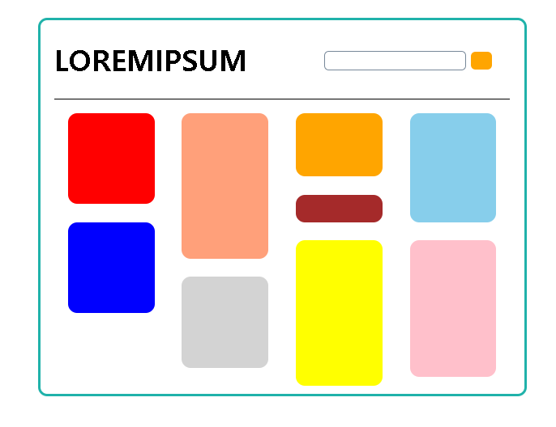
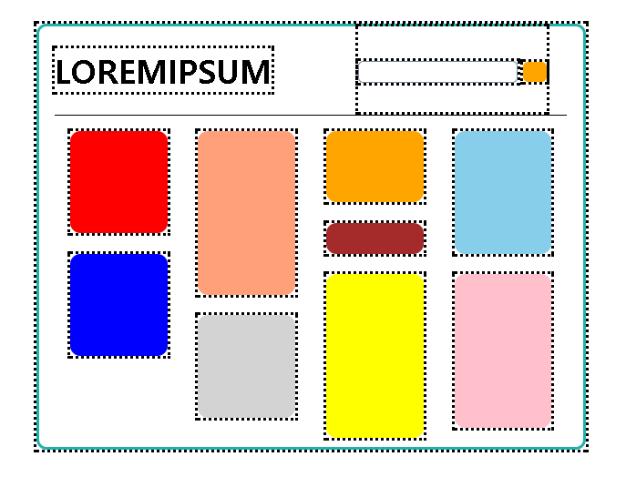

# 3 . 리액트 컴포넌트

컴포넌트는 리액트를 리액트답게 만드는 것 중 하나이다. 컴포넌트는 사용자가 앱을 사용할 때 보게 되는 비주얼과 그 상호작용을 정의하는 주된 방법이다. 예를 들어 완성된 앱의 모습이 아래와 같다고 가정 한다면 리액트 개발자 시각에서는 앱의 비주얼을 담당하는 거의 모든 부분이 컴포넌트라고 하는 독립적인 모듈에 싸여 있다.





위의 점선이 전부 컴포넌트이다. 점선으로 둘러싸인 각 부분은 모양과 기능을 책임지는 개별 컴포넌트를 나타낸다.

<br/>

## 함수에 대한 빠른 리뷰

함수는 중복되는 코드를 압축할 수 있으며 함수안에 다른 함수를 호출할 수 있다. 어떤 함수에서 다른 함수의 호출이 가능하다는 점은 함수가 해야 할 일을 명확히 분리할 수 있게 해준다. 각 작업에 특화된 여러 함수를 만들어 기능을 분배할 수 있다.

함수의 동작을 변경한 다음에는 그 결과 확인 외에 다른 일을 할 필요가 없다. 함수의 시그니처를 바꾸지 않았다면 그 함수를호출하는 코드는 컨드리지 않아도 변경된 함수의 내용대로 동작한다. 

<br/>

## UI를 다루는 방법의 변화

```jsx
// React에서는 인접한 여러 엘리먼트를 출력하기 위해서는 먼저 div로 싸야한다.
// 하지만 React 16부터는 div가 아니라 [] 를 사용해도 제대로 동작한다.
var destination = document.querySelector("#container");
ReactDOM.render(
  <div>
    <h1>Batman</h1>
    <h1>Iron Man</h1>
    <h1>Nicolas Cage</h1>
    <h1>Mega Man</h1>
  </div>,
  destination
);
```

만약 위의 코드에서 h3 태그를 쓰거나 그안에 i태그를 넣거나 할때 하나하나 바꿔줘야 할 것이다.

```jsx
var destination = document.querySelector("#container");
ReactDOM.render(
  <div>
    <h3><i>Batman</i></h3>
    <h3><i>Iron Man</i></h3>
    <h3><i>Nicolas Cage</i></h3>
    <h3><i>Mega Man</i></h3>
  </div>,
  destination
);
```

모든 인스턴스에 대해 h1을 h3로 변경한 것은 모두 중복 작업이다. 더 복잡한 작업이 필요하다면 더 많은 작업이 필요할 것이다. 이것은 전혀 확장성 없는 작업이다. 그러니 웹앱의 비주얼을 정의하는데 함수의 특징을 적용해본 것이 컴포넌트이다.

<br/>

## 리액트 컴포넌트와의 첫 만남

리액트 컴포넌트는 JSX를 통해 HTML 엘리먼트를 출력할 수 있는 재사용 가능한 자바스크립트 덩어리이다. 

```jsx
<!DOCTYPE html>
<html lang="ko">
<head>
    <meta charset="UTF-8">
    <meta name="viewport" content="width=device-width, initial-scale=1.0">
    <meta http-equiv="X-UA-Compatible" content="ie=edge">
    <title>Document</title>
    <script src="https://cdnjs.cloudflare.com/ajax/libs/react/15.6.0/react.js"></script>
    <script src="https://cdnjs.cloudflare.com/ajax/libs/react/15.6.0/react-dom.js"></script>
    <script src="https://cdnjs.cloudflare.com/ajax/libs/babel-core/5.8.24/browser.js"></script>
</head>
<body>
    <div id="container"></div>    
</body>
<script type="text/babel">
ReactDOM.render(
    <div>
        <p>Hello, world!</p>
    </div>,
    document.getElementById('container')
)
</script>
</html>
```

<br/>

### Hello, World! 컴포넌트 만들기

```jsx
const HelloWorld = React.createClass({
  render: ()=>(<p>Hello, componentized world!</p>)
})
```

HelloWorld 컴포넌트를 하나 만들었고, render 속성을 추가해서 원하는 내용을 넣었다. 해당 컴포넌트를 사용하는 방법은 아래와 같이 JSX안에서 호출하는 것이다. 

```jsx
ReactDOM.render(
  <HelloWorld />,
  document.getElementById('container')
)
```

`<HelloWorld>` 컴포넌트는 새로운 HTML 태그인 것으로 생각하면된다. `<HelloWorld />` 를 여러 개 사용하고자 한다면 아래와같이 div를 하나 감싸주면 된다. HelloWorld 컴포넌트의 세부 내용들을 수정하면 그것을 사용하는 모든 부분에서 동일하게 변화한다.

```jsx
ReactDOM.render(
  <div>
    <HelloWorld />
    <HelloWorld />
    <HelloWorld />
    <HelloWorld />
    <HelloWorld />
    <HelloWorld />
  </div>
  document.getElementById('container')
);
```

<br/>

### 속성 지정

함수에 인자를 받아들일수 있게 만들 수 있는 것처럼 컴포넌트도 그와 같이 사용할 수 있다. 컴포넌트에서 인자역할을 하는것은 property라고 한다. 컴포넌트에 property를 추가하기 위해서는 두가지 작업이 필요하다.

**첫 번째 작업 : 컴포넌트 정의 변경** 

속성으로 넘어온 값을 리턴할 수 있도록 컴포넌트의 동작을 변경해야 한다. 예제에서는 greetTarget이라고 정했다.

```jsx
const HelloWorld = React.createClass({
  render : ()=>(<p>Hello, {this.props.greetTarget}!</p>);
});
```

모든 컴포넌트가 접근할 수 있는 props라는 속성을 통해 호출하도록 변경했다. 속성을 중괄호로 감싸서 지정했다. JSX에서는 표현식으로 처리되도록하려면 반드시 중괄호로 감싸야 한다. 그러지 않으면 this.props.greetTarget이라는 문자가 그대로 출력된다.


**두 번째 작업 : 컴포넌트 호출 수정**

그다음은 컴포넌트 호출 시 속성 값을 전달하도록 한다. 컴포넌트 속성의 이름과 동일한 이름의 엘리먼트 속성을 추가함으로써 가능하다. 그리고 컴포넌트의 속성은 원하는 만큼 속성을 추가할 수 있다.

```jsx
ReactDOM.render(
  <div>
  	<HelloWorld greetTarget="Batman"/>
    <HelloWorld greetTarget="Iron Man"/>
    <HelloWorld greetTarget="Nicolas Cage"/>
    <HelloWorld greetTarget="Mega Man"/>
    <HelloWorld greetTarget="Bono"/>
    <HelloWorld greetTarget="Catwoman"/>
  </div>,
  document.querySelector("#container")
)
```

<br/>

### 자식 다루기

컴포넌트는 자식을 가질 수 있다. 

```jsx
<CleverComponent foo="bar">
	<p>Something!!</p>
</CleverComponent>
```

이렇게 `<ClaverComponent>` 안에 p 엘리먼트의 자식이 있다면, CleverComponent안에서는 `this.props.children`을 이용해서 접근이 가능하다. 참고로 this를 쓰기 위해서는 arrow function을 써서는 안된다.

```jsx
const Buttonify = React.createClass({
  render() {
    return (
    <div>
      <button type={this.props.behavior}>
        {this.props.children}
      </button>
    </div>)
  }
});

ReactDOM.render(
  <div>
    <Buttonify behavior="Submit">SEND DATA</Buttonify>
  </div>,
  document.getElementById("container")
)
```

제대로 적용되었다면 type이 Submit인 SEND DATA라는 버튼을 볼수 있을 것이다. 프로퍼티는 this.props.해당프로퍼티로, 엘리먼트의 자식은 this.props.children으로 접근할수 있다. 또한, 자식 엘리먼트가 깊이 중첩된 구조의 최상위에 해당한다면, this.props.children 속성은 배열을 리턴한다. 만약 단일한 자식 엘리먼트라면 this.props.children 속성은 단일 컴포넌트를 리턴한다.