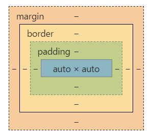

# 두번째 강의

개발자적 사고 : 남이 만들어 놓은 것을 이해하는 과정

코끼리를 전체를 이해하는 시각.. 그것은 스펙문서로 파악할수 있다.


경우의 수가 없는 개발  == 튼튼한 개발

본인만의 노하우로 하게 될경우에 경우의 수가 있는 개발이 될수 있다. == 취약한 개발


개발 입문 시점부터 바른 방법을 알아야 하고 그것은 원리 학습을 해야한다.


## 오늘 배울거

1. 박스모델
2. 노멀 플로우
3. 디스플레이 & 플로트




마진 : 바깥 영역

보더 : 외곽선

패딩 : 안쪽 영역

컨텐츠 : 위의 3개 빼고난 나머지 공간


일반적으로 박스의 크기는 content의 크기아다.

w3c 스펙에서의 width 는 content의 width 이다. 

하지만 ie에서의 박스모델은 border + padding + contents 합이 width 이다.


## Box Model

Css3 에서의 box-sizing : content-box이다. (height, width)

Css3 에서의 box-sizing : padding-box이다. (padding )

Css3 에서의 box-sizing : border-box이다. (include border)


마진은 비가시적인 영역이기 때문에 마진 기준은 없다.

border 를 투명하게 줘서 마진 영역만큼 줘버리면 마진 영역기준인 거 처럼 처리할 수 있다.

패딩은 컨텐츠 박스의 크기를 늘려버릴수 있다.


개발은 다 외워라~~

체계적으로 외워야 한다....

항상 체계가 변화하기 때문에 자기가 안다고 깝치는 게 위험하다.


체계성 없이 공부할 경우에 그 많은 지식들이 서로 부딫히면서 지식의 붕괴가 일어난다.

따라서 충돌없이 바닥부터 체계성 있게 차근차근 외워야 한다.


## Normal Flow

개발에서의 모든 명사는 고유명사이다.

**노멀 플로우**란 html이 렌더링을 할 때 스태틱 모델 (컴퓨터가 알아서 그림) 을 말한다. 

css1에서 position : 스태틱 모델 : 컴퓨터가 알아서 그린다.

position : relative, absolute 는 사용자가 처리한다.


세로로 배치하는 행위 : 블럭

가로로 배치하는 행위 : 인라인


노멀 프로우의 첫번째 동작 ->  

blockformatting context(BFC) : 이 동네는 세로로 배치할거야 라는 행위

inlineformattingcontext(IFC) : 이 동네는 가로로 배치할 거야. 라는 행위

일반적으로 BFC안에서 IFC가 발동된다.

블록 요소들을 배치할수 있는 컨텍스트(감싸고 있는 박스)가 BFC이다. 따라서 블럭과 BFC는 일치하지 않는다.


새로운 BFC들이 생성된다.

바디에서 BFC가 생성 및 발동되면서 블록으로 내려가는 것이다.

블록 안에서는 IFC가 생성  및 발동되면서 글자가 옆으로 써지는 것이다.


태그 구조상 속성인지, 데이터 인지 상관없이 BFC와 IFC로 그냥 배치될 뿐이다.

이러한 것들을 레이어링이고 각각의 레이어는 다른 레이어에 관심이 없다.

HTML그림 그리는 것과 돔은 서로 분리되어 있다.


BFC가 무엇을 담는지. 언제 만들어지는지 알아야 한다.

BFC는 블럭요소를 담을수 있는 일종의 컨테이너이다.


생성시기

바디태그일때 생성

블로그가 아닌 요소가 있다면 생성조건이 된다.

display가 inline-block, table-cell, table-caption일때

overflow가 visible이 아닐때

flex box 일때


BFC는 만들어지고 나면  자식 엘리먼트가 전부 포함된다. 하지만 새로운 BFC가 만들어져서 그안에 포함된 자식엘리먼트는 포함이 안된다. 즉, BFC안에 BFC가 생성되고 그 안에 있는 엘리먼트는 그위의 BFC에는 포함되지 않는다.


### display  3가지 모델

아웃사이드: block, inline, inline-block : 

내가 바깥쪽에 어떻게 지오메트리를 차지해야 하는가, 위치를 확보해야 하는가.

인사이드:  내 안이 어떻게 표현되었으면 좋겟어~.

internal : 인사이드 안에 들어감.


Wrap Content

인라인 요소는 안의 컨텐츠 크기로 크기가 결정된다. width, height를 따로 줄수 없고 안의 컨텐츠가 결정한다.

따라서 마진, 패딩을 줄수없다. 컨텐츠 박스와 외부박스의 크기가 구별이 없다.

그래서 컨트롤하기 위해서 inline-block을 주는 것이다.


width, height를 줄수 잇는 건 블록만 가능하다.

블록 길이를 변경해도 전부 세로로 오는 것은 BFC 때문이다.


float

떠있고 따로 여역을 주지 않는다.

블록 요소에 대해서는 공간을 차지하지 않는다

인라인 요소에는 가이드 한다. float의 기준점은 BFC의 좌상단에서 시작된다.


sudo 코드 : 진짜 이면서 가짜이다. ( 실행은 안되지만..(가짜) 논리는 실제이다.(진짜) )


```.box:after``` 에서의 after은 슈도 엘리먼트이다. 이것은 존재하지 않지만 존재하는 것으로 실제 작동할때에는 작동한다. 엘리먼트가 생성된다. 오직 그리기 위한 엘리먼트이다. (가짜 태그를 만들어 집어넣는다.) .box 에서 자식으로 가장 마지막에 슈도 엘리먼트로 붙일 거다. 중첩 엘리먼트를 할수는 없고 평이한 엘리먼트.. (근데 이거 잘못쓰면 브라우저를 죽인다.)


float는 기본적으로 float안에서는 display : 블럭이다.  임의로 inline을 주더라도 그냥 이렇게된다.


지금 브라우저는 16자리까지. 옛날에는소수점 3자리

33.3333 은 길게 쓰는 습관을 들이는 것이 좋다. 디스플레이에서 픽셀을 처리..


책을 볼때 첫장부터 모르는것이 있으면 그냥 넘어가지 않고 꼭 알아서 이해해야 한다.

그리고 달달 외워라 -_-;

똑같은 소리를 계속해서 한다면 그것은 다른 의미가 있기 때문이다.


미치지 않았는데 미친짓을 하는 경우

1 돈이 걸렸을때 

2 컴플렉스가 있을때


float는 가로줄이 다 찼을때 그 다음 라인으로 갈때에는 그 아래라인에서 세로를 스캔해서 최초의 공간이 존재하는 부분부터 채워지게 된다.

인라인은 하단 베이스 라인을 기준으로 해서 배치가 된다.

